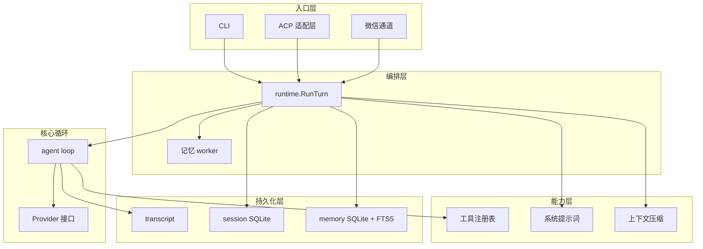
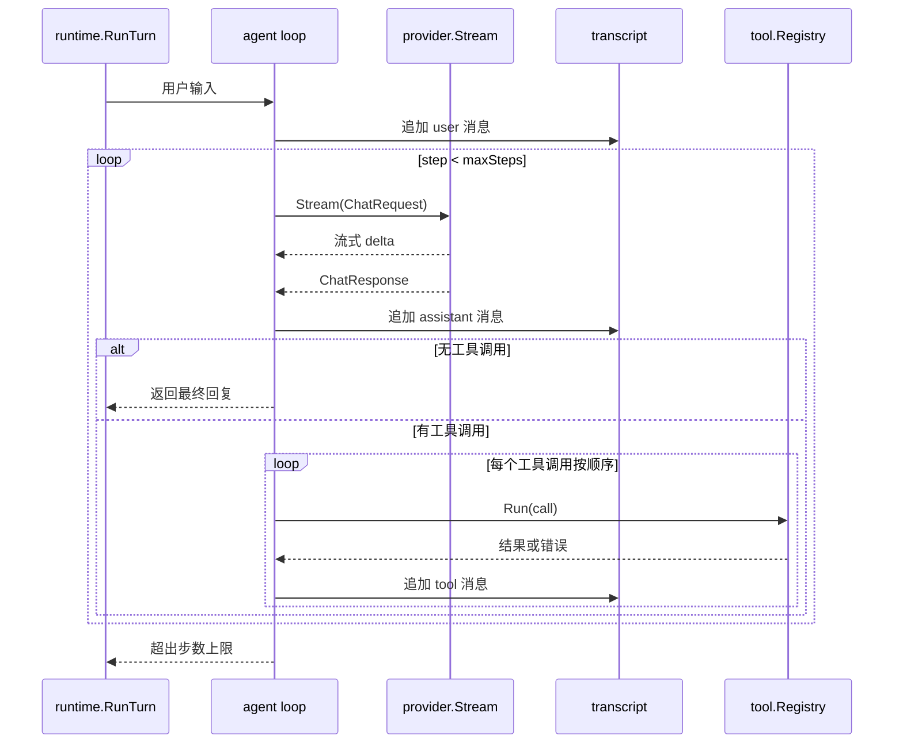
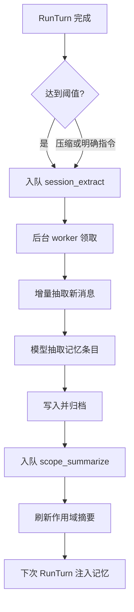

# Atlas

> 一个运行在用户本机上的通用 Agent。可读写文件、执行 Shell、搜索网页、长期记忆，并通过 CLI、ACP 和微信通道驱动同一套 headless agent 核心。

Atlas 用 Go 编写，核心是一个可测试的 headless agent loop。CLI、ACP（供 Zed 等编辑器连接）和微信通道都通过 `internal/runtime` 调用同一套能力，不重复实现循环逻辑。

## 特性

- **Headless agent 核心**：模型 → 工具调用 → 工具结果，按顺序写回 transcript，循环直到完成或达到步数上限。
- **多 Provider 适配**：通过 `chat_completions` 和 `responses` 两种 API 格式适配器接入 OpenAI、DeepSeek 等兼容后端。
- **本地工具集**：文件读写、文本搜索、精确编辑、Shell 执行、网页搜索与提取，开箱即用。
- **上下文压缩**：达到上下文窗口阈值时自动摘要早期对话，保留最近消息继续。
- **长期记忆**：从会话中增量抽取 instruction / fact / workflow 三类记忆，按 global / project 作用域组织，FTS5 检索后注入后续会话。
- **多入口**：CLI 单次执行、ACP 长连接（支持编辑器嵌入终端与文件 diff）、微信扫码远程控制。
- **本地优先**：会话和记忆全部存于本地 SQLite，数据不离开用户机器（除模型 API 和可选的 Tavily 搜索外）。
- **可扩展指令**：通过 `AGENTS.md` 和 skill 文件注入项目级与全局指令，skill 按需加载。

## 架构

### 分层架构

Atlas 分为入口层、编排层、核心循环、能力层和持久化层。所有入口共享同一个 `runtime.Runtime`，核心 agent loop 保持纯粹无副作用。



### 核心循环

一次 turn 从用户输入开始：追加到 transcript，然后循环调用模型。模型返回文本增量时流式输出；返回工具调用时按顺序执行并把结果写回 transcript；没有工具调用或遇到错误时结束。



关键约束：

- 每个 tool call 都有配对的 tool result，顺序与模型返回一致。
- 工具错误作为模型可见的 tool result 写回，让模型可以据此调整。
- 没有 tool call、遇到错误或达到 `max_steps`（默认 8）时结束。

### 长期记忆

记忆系统通过后台 worker 异步工作：会话达到增量阈值、用户明确要求记住、或上下文压缩后，入队抽取任务；worker 只处理上次边界后的新增消息，抽取后刷新受影响作用域的摘要，下次会话自动检索注入。



## 快速开始

### 前置要求

- Go 1.26+
- 一个兼容 OpenAI Chat Completions 或 Responses API 的模型后端（如 DeepSeek、OpenAI）

### 安装

从源码构建：

```sh
git clone https://github.com/liuyuxin/atlas.git
cd atlas
go build -o dist/atlas ./cmd/atlas
```

或使用 [just](https://github.com/casey/just)：

```sh
just build        # 构建到 dist/atlas
just install      # 构建并安装到 ~/.local/bin
```

也可以直接运行：

```sh
go run ./cmd/atlas version
```

### 首次配置

在 `~/.atlas/config.json` 创建配置文件（最小示例）：

```json
{
  "active_provider": "deepseek",
  "providers": [
    {
      "name": "deepseek",
      "format": "chat_completions",
      "base_url": "https://api.deepseek.com",
      "api_key": "sk-...",
      "default_model": "deepseek-v4-flash",
      "models": [
        {
          "value": "deepseek-v4-flash",
          "name": "DeepSeek V4 Flash",
          "context_window": 1000000,
          "max_tokens": 384000,
          "input_formats": ["text"]
        }
      ]
    }
  ]
}
```

验证配置：

```sh
go run ./cmd/atlas doctor
```

### 运行第一个任务

```sh
go run ./cmd/atlas run "读取 README 并总结"
```

## 配置

Atlas 从 `~/.atlas/config.json` 读取配置。完整示例：

```json
{
  "active_provider": "deepseek",
  "providers": [
    {
      "name": "deepseek",
      "format": "chat_completions",
      "base_url": "https://api.deepseek.com",
      "api_key": "sk-...",
      "default_model": "deepseek-v4-flash",
      "models": [
        {
          "value": "deepseek-v4-flash",
          "name": "DeepSeek V4 Flash",
          "context_window": 1000000,
          "max_tokens": 384000,
          "input_formats": ["text"],
          "reasoning_efforts": [
            {
              "value": "high",
              "name": "High"
            },
            {
              "value": "max",
              "name": "Max"
            }
          ]
        },
        {
          "value": "deepseek-v4-pro",
          "name": "DeepSeek V4 Pro",
          "context_window": 1000000,
          "max_tokens": 384000,
          "input_formats": ["text", "image"]
        }
      ]
    },
    {
      "name": "openai",
      "format": "responses",
      "base_url": "https://api.openai.com/v1",
      "api_key": "sk-...",
      "default_model": "gpt-5",
      "models": [
        {
          "value": "gpt-5",
          "name": "GPT-5",
          "context_window": 400000,
          "max_tokens": 128000,
          "input_formats": ["text", "image"],
          "prompt_cache": {
            "enabled": true
          }
        }
      ]
    }
  ],
  "agent": {
    "max_steps": 8,
    "temperature": 0.2,
    "compaction_trigger_ratio": 0.8
  },
  "memory": {
    "enabled": true,
    "model": ""
  },
  "session": {
    "db_path": "~/.atlas/atlas.db"
  },
  "services": {
    "tavily": {
      "api_key": "tvly-..."
    },
    "weixin": {
      "cdn_base_url": "https://novac2c.cdn.weixin.qq.com/c2c"
    }
  }
}
```

### 字段说明

**Provider**

| 字段 | 说明 |
|---|---|
| `active_provider` | 必须匹配某个 `providers[].name`，Atlas 只使用当前选中的 Provider |
| `providers[].format` | 可省略，默认 `chat_completions`；OpenAI Responses API 使用 `responses` |
| `providers[].base_url` | Provider API 地址 |
| `providers[].api_key` | 鉴权密钥 |
| `providers[].default_model` | 必须匹配同一 Provider 下的某个 `models[].value` |

**模型**

| 字段 | 说明 |
|---|---|
| `models[].value` | 发送给 Provider 的模型名 |
| `models[].name` | 显示名 |
| `models[].context_window` | 上下文窗口，用于压缩和用量展示 |
| `models[].max_tokens` | 每次模型请求的最大输出 token 数，需 ≤ `context_window` |
| `models[].input_formats` | 支持的输入格式，当前支持 `text` 和 `image`，且必须包含 `text` |
| `models[].prompt_cache.enabled` | 可省略，默认关闭；设为 `true` 时，同一 Atlas session 会向兼容 Provider 发送稳定的 `prompt_cache_key` |
| `models[].reasoning_efforts` | 声明支持的思考深度选项；未显式选择时使用第一项 |

`prompt_cache.enabled` 只应在确认 Provider 接受对应字段后开启。OpenAI-compatible 服务兼容性不一致；如果开启后请求返回未知字段或 400 错误，删除该模型的 `prompt_cache` 配置即可回退。

**Agent**

| 字段 | 默认值 | 说明 |
|---|---|---|
| `agent.max_steps` | `8` | 单次 turn 最大循环步数 |
| `agent.temperature` | `0` | 采样温度，范围 0–2 |
| `agent.compaction_trigger_ratio` | `0.8` | 上下文输入达到窗口的该比例时自动压缩 |

**记忆**

| 字段 | 默认值 | 说明 |
|---|---|---|
| `memory.enabled` | `true` | 是否启用长期记忆，未配置时默认启用 |
| `memory.model` | 空 | 后台记忆任务使用的模型；为空时使用产生该会话的模型 |

**Session**

| 字段 | 默认值 | 说明 |
|---|---|---|
| `session.db_path` | `~/.atlas/atlas.db` | 会话数据库路径 |

**Services**

| 字段 | 说明 |
|---|---|
| `services.tavily.api_key` | 配置后启用 `web_search` 和 `web_fetch` |
| `services.weixin.base_url` | 可省略，默认 `https://ilinkai.weixin.qq.com` |
| `services.weixin.cdn_base_url` | 可省略，默认 `https://novac2c.cdn.weixin.qq.com/c2c`，用于微信图片下载 |

> **数据库迁移**：当前项目处于早期阶段，不提供迁移框架。schema 变化后请删除旧的 `~/.atlas/atlas.db` 重新生成。

## 使用

### CLI 命令

```sh
atlas run "<prompt>"                              # 执行单次任务
atlas run --model <value> "<prompt>"              # 指定模型
atlas run --session <id> "<prompt>"               # 恢复或创建指定 session
atlas acp                                          # 启动 ACP 服务
atlas doctor                                       # 离线诊断
atlas sessions                                     # 列出会话
atlas session show <id>                            # 查看会话内容
atlas session compact <id>                         # 压缩会话上下文
atlas session delete <id>                          # 删除会话
atlas weixin login                                 # 微信扫码登录
atlas weixin serve                                 # 启动微信通道
atlas weixin accounts                              # 查看已登录账号
atlas weixin logout <account-id>                   # 登出微信账号
atlas version                                      # 查看版本
```

裸 `atlas` 是交互模式入口；当前版本暂未实现 TUI，会提示使用 `atlas run`。

`atlas run` 默认创建新 session。传入 `--session <id>` 时恢复或创建指定 session；传入 `--model <value>` 时，本轮使用该模型。session ID 只允许字母、数字、`.`、`_` 和 `-`。

### 直连 Shell

用户输入以 `!` 开头时，Atlas 跳过模型，直接把后续内容作为平台默认 shell 命令执行并返回输出，比如 `!pwd` 或 `!git status`。

通过 shell 调 CLI 时，建议使用单引号或转义 `!`，避免 zsh 或 bash 历史展开改写命令：

```sh
go run ./cmd/atlas run '!pwd'
```

### 诊断

`atlas doctor` 只做离线诊断，检查配置、Provider 配置摘要、agent 参数、session 数据库、长期记忆表、Tavily 配置和默认 shell，不调用模型或 Tavily API。

### 会话与压缩

Atlas 使用 SQLite 保存本地会话和长期记忆，默认路径 `~/.atlas/atlas.db`。

会话支持创建、恢复、列表、查看、删除和上下文压缩。`/compact` 或 `atlas session compact <id>` 会把较早上下文摘要化，并保留最近消息继续对话。达到 `compaction_trigger_ratio` 时也会自动压缩。

### 长期记忆

长期记忆默认启用。Atlas 会在新增消息达到阈值、用户明确要求记住信息或上下文压缩后，把增量抽取任务写入后台队列。ACP 和微信等长连接入口会处理队列，并在后续请求中自动检索相关记忆。

记忆分三类：

- `instruction`：用户长期偏好或约束
- `fact`：项目事实
- `workflow`：可复用的项目操作流程

按 `global`（跨项目）和 `project`（按项目目录）两个作用域组织。

## 通道

### ACP

`atlas acp` 通过 stdin/stdout 启动 [Agent Client Protocol](https://agentclientprotocol.com/) 服务，供 Zed 等编辑器连接。

当前支持：

- session 创建、恢复、加载历史回放、列表分页、删除
- prompt、取消、关闭
- 模型切换、思考强度切换、思维链流式更新
- embedded text resource
- session info 和 usage update
- 客户端 terminal 展示 `run_shell` 输出
- 文件工具 locations/diff 展示
- 图片输入
- 长期记忆后台 worker
- `/compact` slash command
- skill slash command，例如 `/think ...`

通过 ACP 连接时，Atlas 会优先使用客户端声明的能力：

- **terminal capability**：`run_shell` 请求客户端 terminal 执行，并嵌入输出
- **filesystem capability**：文件工具请求客户端读写文件，并展示 locations/diff

客户端不支持或调用失败时，Atlas 回退到本地工具执行。

`additionalDirectories` 会作为 session 元数据保存和返回，但相对路径仍以 `cwd` 为基准。当前不支持 ACP auth、权限请求、MCP 连接，也不支持音频和非图片二进制资源输入。

### 微信

`atlas weixin login` 使用微信扫码登录，并把账号 token 保存到 `~/.atlas/weixin/accounts`。`atlas weixin serve` 连接微信 Bot，长轮询文本和图片消息并调用本地 Atlas runtime。

微信通道拥有与本机 Atlas 进程相同的文件和 shell 权限。首次收到消息时，工作目录使用 `atlas weixin serve` 启动时的当前目录。当前只支持扫码登录的微信用户本人控制 Atlas，不支持群聊、音频、视频或添加其他控制人。

微信聊天支持的斜杠命令：

| 命令 | 说明 |
|---|---|
| `/help` | 查看命令 |
| `/status` | 查看当前工作目录和 session |
| `/cwd` | 查看当前工作目录 |
| `/cwd /absolute/path` | 切换工作目录，下一条普通消息开启新对话 |
| `/cwd -` | 切回上一个工作目录 |
| `/new` | 在当前工作目录开启新对话 |
| `/sessions` | 查看当前工作目录最近会话 |
| `/sessions all` | 查看全局最近会话 |
| `/resume <session-id>` | 恢复指定会话，并切换到该会话的工作目录 |
| `/compact` | 压缩当前会话上下文 |
| `/cancel` | 取消当前正在运行的 turn |

## 内置工具

| 工具 | 说明 |
|---|---|
| `glob` | 按 glob pattern 查找文件和目录，默认从会话工作目录开始 |
| `read_file` | 读取文本文件 |
| `grep` | 用正则搜索文本，默认从会话工作目录开始 |
| `edit_file` | 精确替换一个唯一文本块 |
| `apply_patch` | 应用 unified diff patch，可一次修改多个文件 |
| `write_file` | 写入文件内容 |
| `run_shell` | 使用平台默认 shell 执行命令；Windows 用 PowerShell，其他平台用 `/bin/sh` |
| `load_skill` | 按名称加载本地 skill 指令 |
| `web_search` | 使用 Tavily 搜索公网网页，需配置 `services.tavily.api_key` |
| `web_fetch` | 使用 Tavily 提取公网网页内容，需配置 `services.tavily.api_key` |

## 指令与 Skill

Atlas 加载两个附加指令文件（当前用户请求优先于指令文件，当前目录指令优先于全局指令，不递归查找父目录或子目录）：

- `~/.atlas/AGENTS.md`
- 当前工作目录下的 `AGENTS.md`

Atlas 也会扫描用户级和当前目录级 skill，只把 `name` 和 `description` 摘要放进系统提示词；需要完整指令时，模型通过 `load_skill` 读取对应 `SKILL.md`。通过 ACP 连接时，可调用 skill 会按当前 session 工作目录暴露为 `/<skill>` 命令；用户输入会原样传给模型，并在本轮直接注入对应的完整 `SKILL.md`。

## 权限与安全

Atlas 以当前进程的本地权限运行。内置工具可以读写文件、搜索文本并执行 shell 命令；**Atlas 不提供沙箱、权限提示或 approval gate**。请只在可信工作区中运行。

所有会话和记忆数据存储在本地 SQLite，不离开用户机器——除模型 API 调用和可选的 Tavily 搜索外。

## 开发

### 项目结构

```text
cmd/atlas              CLI 入口
internal/acp           ACP 协议适配与客户端能力桥接
internal/agent         headless agent loop（核心循环）
internal/compact       上下文压缩规划与摘要
internal/config        配置加载与校验
internal/memory        长期记忆条目、摘要、FTS 检索与任务队列
internal/model         通用聊天协议与 Provider 接口
internal/prompt        系统提示词构造
internal/provider      按 API 格式实现的 Provider 适配器
  ├── chatcompletions  Chat Completions API
  └── responses        OpenAI Responses API
internal/runtime       编排层，串联 agent、工具、session 和记忆
internal/session       SQLite 会话持久化
internal/skill         skill 扫描与加载
internal/tool          工具注册表与内置工具
internal/transcript    内存消息序列
internal/version       版本信息
internal/weixin        微信通道
```

### 构建与测试

```sh
go build ./cmd/atlas           # 构建
go test ./...                  # 运行全部测试
go test ./internal/agent/...   # 运行单个包的测试
just check                     # fmt + tidy + test（需安装 just）
```

### 设计原则

- **小而可验证**：agent loop 保持纯粹无副作用，所有副作用集中在 runtime，便于用 fake Provider 测试。
- **不提前抽象**：两个真实调用点出现前不抽象，不为"可能以后"保留两套接口。
- **本地权限边界**：不引入权限抽象，工具拥有本机进程的全部权限。
- **单一核心**：CLI、ACP、微信共享同一个 `runtime.Runtime` 和 agent loop，通道层只做协议适配。
