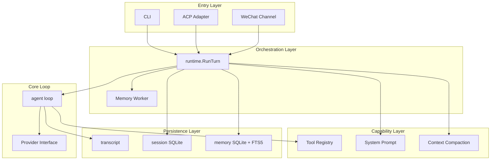
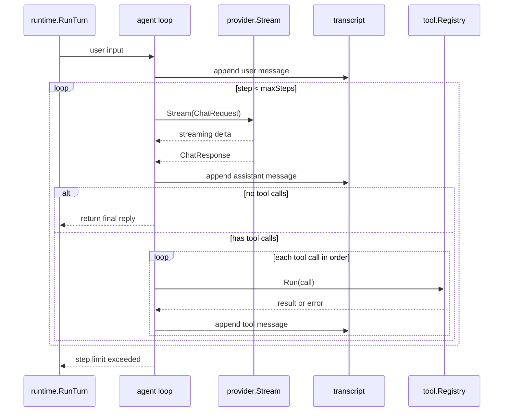

# Atlas

A general-purpose agent built in Go. The core is a testable headless agent loop that can read and write files, execute shell commands, search the web, and maintain long-term memory. CLI, ACP (for editors like Zed), and WeChat channels all call into the same capabilities via `internal/runtime` without duplicating loop logic.

[中文文档](README.zh-CN.md)

## Features

- **Headless agent core**: model → tool calls → tool results, written back to transcript in order, looping until completion or step limit.
- **Multi-provider adapters**: connect to OpenAI, DeepSeek, and other compatible backends via `chat_completions` and `responses` API formats.
- **Built-in tools**: file read/write, text search, precise editing, shell execution, web search and extraction — ready out of the box.
- **Context compaction**: automatically summarizes earlier conversation when the context window threshold is reached, keeping recent messages to continue.
- **Long-term memory**: incrementally extracts instruction / fact / workflow memories from sessions, organized by global / project scope, retrieved via FTS5 and injected into subsequent sessions.
- **Multiple entry points**: CLI one-shot execution, ACP persistent connection (with editor-embedded terminal and file diff), WeChat QR-code remote control.
- **Local-first**: all sessions and memories stored in local SQLite. Data never leaves your machine (except model API calls and optional Tavily search).
- **Extensible instructions**: inject project-level and global instructions via `AGENTS.md` and skill files. Skills are loaded on demand.

## Architecture

### Layered Design

Atlas is divided into entry layer, orchestration layer, core loop, capability layer, and persistence layer. All entry points share the same `runtime.Runtime`, and the core agent loop remains pure and side-effect-free.



### Core Loop

A turn starts with user input: appended to the transcript, then the model is called in a loop. When the model returns text deltas, they are streamed out; when it returns tool calls, they are executed in order and results are written back to the transcript. The loop ends when there are no tool calls, an error occurs, or the step limit is reached.



Key constraints:

- Every tool call has a paired tool result, in the same order the model returned them.
- Tool errors are written back as model-visible tool results, letting the model adjust accordingly.
- The loop ends when there are no tool calls, an error occurs, or `max_steps` (default 20) is reached.

### Long-Term Memory

The memory system works asynchronously via a background worker. There are three trigger conditions: session message count reaches an incremental threshold, the user explicitly asks to remember something, or context compaction completes. When triggered, an extraction task is enqueued. The worker only processes new messages since the last boundary, calls the model to extract memory entries and writes them to the database, then refreshes summaries for affected scopes. Relevant memories are automatically retrieved and injected into the system prompt at the start of the next session.

## Quick Start

### Prerequisites

- Go 1.26+
- A model backend compatible with OpenAI Chat Completions or Responses API (e.g. DeepSeek, OpenAI)

### Installation

Build from source:

```sh
git clone https://github.com/gvenusleo/atlas.git
cd atlas
go build -o dist/atlas ./cmd/atlas
```

Or with [just](https://github.com/casey/just):

```sh
just build        # build to dist/atlas
just install      # build and install to ~/.local/bin
```

You can also run directly:

```sh
go run ./cmd/atlas version
```

### Initial Configuration

Create a config file at `~/.atlas/config.json` (minimal example):

```json
{
  "active_provider": "deepseek",
  "providers": [
    {
      "name": "deepseek",
      "format": "chat_completions",
      "base_url": "https://api.deepseek.com",
      "api_key": "sk-...",
      "default_model": "deepseek-v4-flash",
      "models": [
        {
          "value": "deepseek-v4-flash",
          "name": "DeepSeek V4 Flash",
          "context_window": 1000000,
          "max_tokens": 384000,
          "input_formats": ["text"]
        }
      ]
    }
  ]
}
```

Verify your configuration:

```sh
go run ./cmd/atlas doctor
```

### Run Your First Task

```sh
go run ./cmd/atlas run "Read README and summarize"
```

## Configuration

Atlas reads configuration from `~/.atlas/config.json`. Full example:

```json
{
  "active_provider": "deepseek",
  "providers": [
    {
      "name": "deepseek",
      "format": "chat_completions",
      "base_url": "https://api.deepseek.com",
      "api_key": "sk-...",
      "default_model": "deepseek-v4-flash",
      "models": [
        {
          "value": "deepseek-v4-flash",
          "name": "DeepSeek V4 Flash",
          "context_window": 1000000,
          "max_tokens": 384000,
          "input_formats": ["text"],
          "reasoning_efforts": [
            {
              "value": "high",
              "name": "High"
            },
            {
              "value": "max",
              "name": "Max"
            }
          ]
        },
        {
          "value": "deepseek-v4-pro",
          "name": "DeepSeek V4 Pro",
          "context_window": 1000000,
          "max_tokens": 384000,
          "input_formats": ["text", "image"]
        }
      ]
    },
    {
      "name": "openai",
      "format": "responses",
      "base_url": "https://api.openai.com/v1",
      "api_key": "sk-...",
      "default_model": "gpt-5",
      "models": [
        {
          "value": "gpt-5",
          "name": "GPT-5",
          "context_window": 400000,
          "max_tokens": 128000,
          "input_formats": ["text", "image"],
          "prompt_cache": {
            "enabled": true
          }
        }
      ]
    }
  ],
  "agent": {
    "max_steps": 20,
    "temperature": 0.2,
    "compaction_trigger_ratio": 0.8
  },
  "memory": {
    "enabled": true,
    "model": ""
  },
  "session": {
    "db_path": "~/.atlas/atlas.db"
  },
  "services": {
    "tavily": {
      "api_key": "tvly-..."
    },
    "weixin": {
      "cdn_base_url": "https://novac2c.cdn.weixin.qq.com/c2c"
    }
  }
}
```

### Field Reference

**Provider**

| Field | Description |
|---|---|
| `active_provider` | Must match a `providers[].name`. Atlas only uses the selected provider. |
| `providers[].format` | Optional, defaults to `chat_completions`. Use `responses` for OpenAI Responses API. |
| `providers[].base_url` | Provider API URL. |
| `providers[].api_key` | Authentication key. |
| `providers[].default_model` | Must match a `models[].value` under the same provider. |

**Models**

| Field | Description |
|---|---|
| `models[].value` | Model name sent to the provider. |
| `models[].name` | Display name. |
| `models[].context_window` | Context window size, used for compaction and usage display. |
| `models[].max_tokens` | Maximum output tokens per model request, must be ≤ `context_window`. |
| `models[].input_formats` | Supported input formats: `text` and `image`. Must include `text`. |
| `models[].prompt_cache.enabled` | Optional, defaults to off. When `true`, sends a stable `prompt_cache_key` to compatible providers within the same session. |
| `models[].reasoning_efforts` | Declares supported reasoning depth options. Uses the first option when not explicitly selected. |

Only enable `prompt_cache.enabled` after confirming the provider accepts the corresponding field. OpenAI-compatible services vary in compatibility; if requests return unknown field errors or 400s after enabling, remove the `prompt_cache` config for that model to fall back.

**Agent**

| Field | Default | Description |
|---|---|---|
| `agent.max_steps` | `20` | Maximum loop steps per turn. |
| `agent.temperature` | `0` | Sampling temperature, range 0–2. |
| `agent.compaction_trigger_ratio` | `0.8` | Auto-compaction triggers when context input reaches this ratio of the window. |

**Memory**

| Field | Default | Description |
|---|---|---|
| `memory.enabled` | `true` | Enable long-term memory. Defaults to enabled when not configured. |
| `memory.model` | empty | Model used for background memory tasks. Uses the session's model when empty. |

**Session**

| Field | Default | Description |
|---|---|---|
| `session.db_path` | `~/.atlas/atlas.db` | Session database path. |

**Services**

| Field | Description |
|---|---|
| `services.tavily.api_key` | Enables `web_search` and `web_fetch` when configured. |
| `services.weixin.base_url` | Optional, defaults to `https://ilinkai.weixin.qq.com`. |
| `services.weixin.cdn_base_url` | Optional, defaults to `https://novac2c.cdn.weixin.qq.com/c2c`. Used for WeChat image downloads. |

> **Database migration**: The project is in early stage and does not provide a migration framework. After schema changes, delete the old `~/.atlas/atlas.db` to recreate.

## Usage

### CLI Commands

```sh
atlas run "<prompt>"                              # run a one-shot task
atlas run --model <value> "<prompt>"              # specify model
atlas run --session <id> "<prompt>"               # resume or create a specific session
atlas acp                                          # start ACP service
atlas doctor                                       # offline diagnostics
atlas sessions                                     # list sessions
atlas session show <id>                            # view session content
atlas session compact <id>                         # compact session context
atlas session delete <id>                          # delete a session
atlas weixin login                                 # WeChat QR login
atlas weixin serve                                 # start WeChat channel
atlas weixin accounts                              # list logged-in accounts
atlas weixin logout <account-id>                   # logout a WeChat account
atlas version                                      # show version
```

Bare `atlas` is the interactive mode entry point; the current version does not yet implement a TUI and will prompt you to use `atlas run`.

`atlas run` creates a new session by default. Pass `--session <id>` to resume or create a specific session; pass `--model <value>` to use that model for this turn. Session IDs only allow letters, digits, `.`, `_`, and `-`.

### Direct Shell

When user input starts with `!`, Atlas skips the model and directly executes the rest as a platform-default shell command, e.g. `!pwd` or `!git status`.

When calling the CLI from a shell, use single quotes or escape `!` to prevent zsh or bash history expansion:

```sh
go run ./cmd/atlas run '!pwd'
```

### Diagnostics

`atlas doctor` performs offline diagnostics only: checks configuration, provider config summary, agent parameters, session database, long-term memory tables, Tavily config, and default shell. It does not call the model or Tavily API.

### Sessions and Compaction

Atlas uses SQLite to store local sessions and long-term memory, default path `~/.atlas/atlas.db`.

Sessions support creation, resumption, listing, viewing, deletion, and context compaction. `/compact` or `atlas session compact <id>` summarizes earlier context while keeping recent messages to continue the conversation. Auto-compaction also triggers when `compaction_trigger_ratio` is reached.

### Long-Term Memory

Long-term memory is enabled by default. Atlas enqueues incremental extraction tasks when new messages reach a threshold, when the user explicitly asks to remember information, or after context compaction. ACP and WeChat (persistent connection entry points) process the queue and automatically retrieve relevant memories in subsequent requests.

Memory types:

- `instruction`: long-term user preferences or constraints
- `fact`: project facts
- `workflow`: reusable project workflows

Organized by `global` (cross-project) and `project` (per project directory) scopes.

## Channels

### ACP

`atlas acp` starts an [Agent Client Protocol](https://agentclientprotocol.com/) service via stdin/stdout for editors like Zed to connect.

Currently supported:

- Session creation, resumption, history replay, paginated listing, deletion
- Prompt, cancel, close
- Model switching, reasoning effort switching, chain-of-thought streaming
- Embedded text resources
- Session info and usage updates
- Client terminal for `run_shell` output
- File tool locations/diff display
- Image input
- Long-term memory background worker
- `/compact` slash command
- Skill slash commands, e.g. `/think ...`

When connected via ACP, Atlas prefers client-declared capabilities:

- **Terminal capability**: `run_shell` requests the client terminal to execute and embeds the output.
- **Filesystem capability**: file tools request the client to read/write files and display locations/diffs.

When the client doesn't support a capability or the call fails, Atlas falls back to local tool execution.

`additionalDirectories` are saved and returned as session metadata, but relative paths are still resolved from `cwd`. ACP auth, permission requests, MCP connections, audio, and non-image binary resource input are not currently supported.

### WeChat

`atlas weixin login` logs in via WeChat QR code and saves the account token to `~/.atlas/weixin/accounts`. `atlas weixin serve` connects to the WeChat Bot, long-polls text and image messages, and invokes the local Atlas runtime.

The WeChat channel has the same file and shell permissions as the local Atlas process. The working directory for the first message uses the current directory when `atlas weixin serve` starts. Only the WeChat user who logged in via QR code can control Atlas. Group chats, audio, video, and adding other controllers are not supported.

Slash commands available in WeChat chat:

| Command | Description |
|---|---|
| `/help` | Show commands |
| `/status` | Show current working directory and session |
| `/cwd` | Show current working directory |
| `/cwd /absolute/path` | Switch working directory; next regular message starts a new conversation |
| `/cwd -` | Switch back to the previous working directory |
| `/new` | Start a new conversation in the current working directory |
| `/sessions` | List recent sessions for the current working directory |
| `/sessions all` | List recent sessions across all working directories |
| `/resume <session-id>` | Resume a session and switch to its working directory |
| `/compact` | Compact current session context |
| `/cancel` | Cancel the currently running turn |

## Built-in Tools

| Tool | Description |
|---|---|
| `glob` | Find files and directories by glob pattern, defaulting to the session working directory |
| `read_file` | Read a text file |
| `grep` | Search text with regex, defaulting to the session working directory |
| `edit_file` | Replace a single unique text block |
| `apply_patch` | Apply a unified diff patch, can modify multiple files at once |
| `write_file` | Write file content |
| `run_shell` | Execute a command using the platform-default shell; PowerShell on Windows, `/bin/sh` elsewhere |
| `load_skill` | Load a local skill's instructions by name |
| `web_search` | Search the public web with Tavily; requires `services.tavily.api_key` |
| `web_fetch` | Extract public web page content with Tavily; requires `services.tavily.api_key` |

## Instructions and Skills

Atlas loads two additional instruction files (current user requests take precedence over instruction files; current-directory instructions take precedence over global ones; parent and child directories are not searched recursively):

- `~/.atlas/AGENTS.md`
- `AGENTS.md` in the current working directory

Atlas also scans user-level and current-directory-level skills, injecting only `name` and `description` summaries into the system prompt. When full instructions are needed, the model reads the corresponding `SKILL.md` via `load_skill`. When connected via ACP, available skills are exposed as `/<skill>` commands scoped to the current session's working directory. User input is passed as-is to the model, and the full `SKILL.md` is injected directly for that turn.

## Permissions and Security

Atlas runs with the local permissions of the current process. Built-in tools can read and write files, search text, and execute shell commands. **Atlas does not provide a sandbox, permission prompts, or an approval gate.** Only run in trusted workspaces.

All session and memory data is stored in local SQLite and never leaves your machine — except for model API calls and optional Tavily search.

## Development

### Project Structure

```text
cmd/atlas              CLI entry point
internal/acp           ACP protocol adapter and client capability bridge
internal/agent         headless agent loop (core loop)
internal/compact       context compaction planning and summarization
internal/config        config loading and validation
internal/memory        long-term memory entries, summaries, FTS retrieval, and task queue
internal/model         generic chat protocol and Provider interface
internal/prompt        system prompt construction
internal/provider      provider adapters by API format
  ├── chatcompletions  Chat Completions API
  └── responses        OpenAI Responses API
internal/runtime       orchestration layer, connecting agent, tools, session, and memory
internal/session       SQLite session persistence
internal/skill         skill scanning and loading
internal/tool          tool registry and built-in tools
internal/transcript    in-memory message sequence
internal/version       version info
internal/weixin        WeChat channel
```

### Build and Test

```sh
go build ./cmd/atlas           # build
go test ./...                  # run all tests
go test ./internal/agent/...   # run a single package's tests
just check                     # fmt + tidy + test (requires just)
```

### Design Principles

- **Small and verifiable**: the agent loop stays pure and side-effect-free. All side effects are concentrated in runtime, making it easy to test with fake providers.
- **No premature abstraction**: don't abstract before two real call sites exist. Don't keep duplicate interfaces for "maybe later."
- **Local permission boundary**: no permission abstraction. Tools have the full permissions of the host process.
- **Single core**: CLI, ACP, and WeChat share the same `runtime.Runtime` and agent loop. Channel layers only do protocol adaptation.
