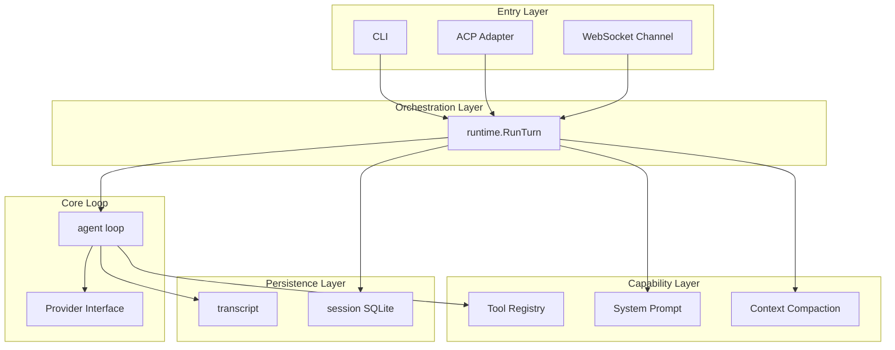
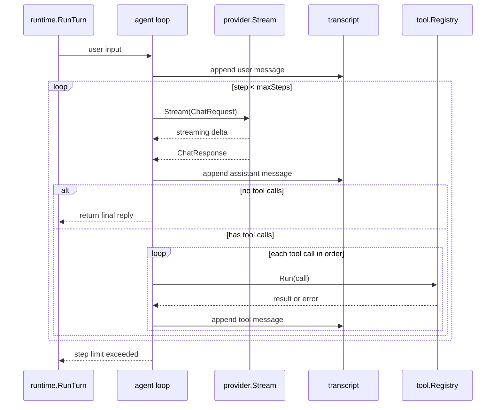

# Architecture

[中文](zh-CN/architecture.md)

## Layered Design

Atlas is divided into entry layer, orchestration layer, core loop, capability layer, and persistence layer. All entry points share the same `runtime.Runtime`. The core agent loop remains headless, dependency-injected, and independently testable; runtime owns configuration, persistence, and orchestration.

## Core Loop

A turn starts with user input: appended to the transcript, then the model is called in a loop. When the model returns text deltas, they are streamed out; when it returns tool calls, they are executed in order and results are written back to the transcript. The loop ends when there are no tool calls, an error occurs, or the step limit is reached.

Key constraints:

- Every tool call has a paired tool result, in the same order the model returned them.
- Tool errors are written back as model-visible tool results, letting the model adjust accordingly.
- The loop ends when there are no tool calls, an error occurs, or `max_steps` (default 20) is reached.

## Context Compaction and Todos

When context compaction triggers, earlier messages are summarized while recent messages are kept to continue the conversation. If the model has been using `todo_write` to track tasks, the last todo list is extracted from the transcript and incomplete items are injected into the summary prompt. This ensures the model retains awareness of pending work after compaction, without persisting todo state to the database.
