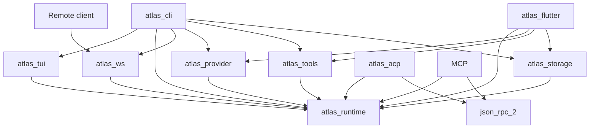

# Architecture

[中文](zh-CN/architecture.md)

> **Status:** Planned. Only the Flutter application shell currently contains implementation code.

## System Shape

Atlas uses one Dart runtime implementation with local application composition
roots and optional remote transports. No presentation or protocol adapter owns
a separate agent loop.

```mermaid
graph TD
    CLI[atlas_cli] --> TUI[atlas_tui]
    CLI --> RT[atlas_runtime]
    CLI --> WS[atlas_ws]
    CLI --> PROVIDER[atlas_provider]
    CLI --> TOOLS[atlas_tools]
    CLI --> STORAGE[atlas_storage]
    FL[atlas_flutter] --> RT
    FL --> PROVIDER
    FL --> TOOLS
    FL --> STORAGE
    TUI --> RT
    REMOTE[Remote client] --> WS
    WS --> RT
    ACP[atlas_acp] --> RT[atlas_runtime]
    MCP --> RT
    PROVIDER --> RT
    TOOLS --> RT
    STORAGE --> RT
    ACP --> JRPC[json_rpc_2]
    MCP --> JRPC
```

`atlas_cli` and `atlas_flutter` each compose one runtime for their own process.
Running `atlas` will enter the Nocterm TUI by default. Running `atlas server`
will inject the composed runtime handler into `atlas_ws` for remote clients.
Local Flutter and Nocterm interactions do not serialize through the remote
protocol. ACP is an inbound adapter to the same runtime; MCP primarily connects
external tools to the tool layer.

## Package Responsibilities

| Package | Responsibility |
|---|---|
| `atlas_runtime` | Domain models, run events, ports, the single agent engine, orchestration, cancellation, compaction, and skills |
| `atlas_storage` | Drift persistence, queries, and schema migrations |
| `atlas_provider` | Provider authentication and provider-specific wire conversion |
| `atlas_tools` | Built-in tool implementations with structured calls and results |
| `atlas_ws` | Versioned WebSocket wire contract, codecs, client and server transport, and runtime conversion |
| `atlas_acp` | ACP server adaptation to the shared runtime |
| `atlas_mcp` | MCP client first, with server support deferred until needed |
| `atlas_tui` | Nocterm rendering and terminal interaction over an injected runtime interface |
| `atlas_cli` | Composition root for the default TUI, `server`, and other CLI commands |
| `atlas_flutter` | Composition root and presentation client for desktop and mobile |

## Dependency Rules

- `atlas_runtime` owns domain models and ports but has no dependency on Flutter, storage, providers, tools, or transports.
- Storage, provider, and tool packages depend on and implement runtime ports; adapters do not own orchestration.
- Provider-specific request fields remain in `atlas_provider`.
- `atlas_ws` may depend on runtime types but owns an explicit versioned wire schema rather than serializing runtime objects directly. It accepts an injected request handler and does not compose runtime services.
- Local Flutter and Nocterm presentation code receives runtime interfaces directly. Only application bootstrap code constructs provider, tool, and storage adapters.
- `atlas_cli` and `atlas_flutter` are separate process-level composition roots; they share runtime code, not runtime instances.
- ACP and MCP own their protocol lifecycle rules and use `json_rpc_2` directly. Shared wrappers are extracted only after stable duplication exists.

## Runtime Contracts

The future runtime must preserve these product-level contracts:

- Each model tool call receives one model-visible result in the original order, including failures.
- Run events are emitted in occurrence order so clients do not regroup output after a turn.
- Cancellation before a run starts creates no timeline item. Cancellation after user input reaches the runtime preserves the interrupted run boundary.
- Selecting a skill preserves the original user text in history. Full skill instructions are turn-scoped model context rather than transcript content.
- Compaction preserves the durable timeline while replacing only the active context checkpoint. An optional compact instruction changes the generated summary, not user history.

These contracts define expected behavior, not compatibility with the removed Go implementation or its database schema.

## Local Security Boundary

Atlas tools run with the permissions of the local Atlas process. The product does not provide a sandbox, permission prompts, or an approval gate. Protocol adapters must not imply a stronger security boundary than the runtime provides.
