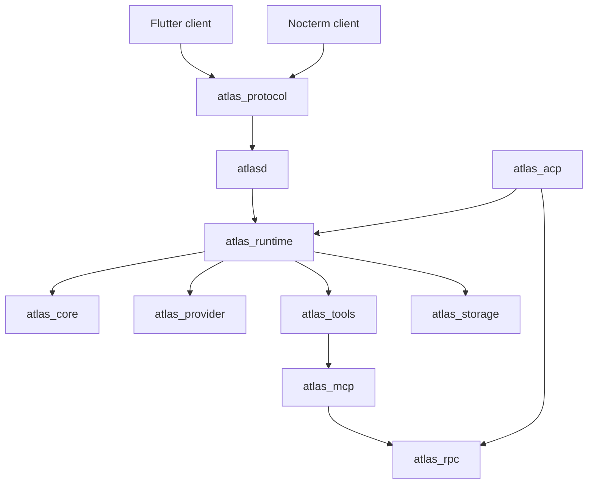

# Architecture

[中文](zh-CN/architecture.md)

> **Status:** Planned. Only the Flutter application shell currently contains implementation code.

## System Shape

Atlas uses one Dart runtime with multiple protocol and presentation adapters. No client or channel owns a separate agent loop.

```mermaid
graph TD
    FL[Flutter client] --> AP[atlas_protocol]
    TUI[Nocterm client] --> AP
    AP --> D[atlasd]
    ACP[atlas_acp] --> RT[atlas_runtime]
    D --> RT
    RT --> CORE[atlas_core]
    RT --> PROVIDER[atlas_provider]
    RT --> TOOLS[atlas_tools]
    RT --> STORAGE[atlas_storage]
    TOOLS --> MCP[atlas_mcp]
    ACP --> RPC[atlas_rpc]
    MCP --> RPC
```

`atlasd` is the local composition root and exposes the versioned client protocol. Flutter and Nocterm are clients of that protocol. ACP is an inbound adapter to the same runtime; MCP primarily connects external tools to the tool layer.

## Package Responsibilities

| Package | Responsibility |
|---|---|
| `atlas_core` | Stable domain models, run events, and ports |
| `atlas_runtime` | The single agent engine, orchestration, cancellation, compaction, and skills |
| `atlas_storage` | SQLite persistence and schema migrations |
| `atlas_provider` | Provider authentication and provider-specific wire conversion |
| `atlas_tools` | Built-in tool implementations with structured calls and results |
| `atlas_rpc` | Generic JSON-RPC transport and request lifecycle |
| `atlas_protocol` | Versioned DTOs shared by Atlas clients and `atlasd` |
| `atlas_acp` | ACP server adaptation to the shared runtime |
| `atlas_mcp` | MCP client first, with server support deferred until needed |
| `atlas_tui` | Nocterm rendering and terminal interaction |
| `atlasd` | Runtime composition and local WebSocket host |
| `atlas_cli` | Command-line and terminal application entry point |
| `atlas_flutter` | Desktop and mobile presentation client |

## Dependency Rules

- `atlas_core` has no dependency on Flutter, storage, providers, tools, or transports.
- Runtime effects enter through core ports; adapters do not own orchestration.
- Provider-specific request fields remain in `atlas_provider`.
- Protocol DTOs are not persistence entities and do not expose provider payloads.
- Flutter and Nocterm depend on `atlas_protocol`, never on runtime implementation packages.
- ACP and MCP own protocol lifecycle rules; generic JSON-RPC behavior belongs in `atlas_rpc`.

## Runtime Contracts

The future runtime must preserve these product-level contracts:

- Each model tool call receives one model-visible result in the original order, including failures.
- Run events are emitted in occurrence order so clients do not regroup output after a turn.
- Cancellation before a run starts creates no timeline item. Cancellation after user input reaches the runtime preserves the interrupted run boundary.
- Selecting a skill preserves the original user text in history. Full skill instructions are turn-scoped model context rather than transcript content.
- Compaction preserves the durable timeline while replacing only the active context checkpoint. An optional compact instruction changes the generated summary, not user history.

These contracts define expected behavior, not compatibility with the removed Go implementation or its database schema.

## Local Security Boundary

Atlas tools run with the permissions of the local Atlas process. The product does not provide a sandbox, permission prompts, or an approval gate. Protocol adapters must not imply a stronger security boundary than the runtime provides.
