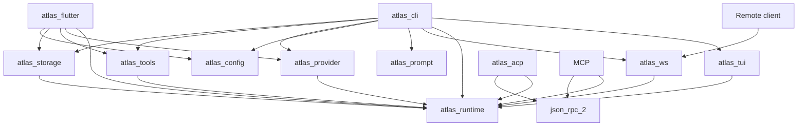

# Architecture

[中文](zh-CN/architecture.md)

> **Status:** In progress. `atlas_runtime`, `atlas_storage`, the `atlas_provider`
> adapters, `atlas_config` loading, the built-in `atlas_tools`, and
> `atlas_prompt` prompt construction are executable. `atlas_cli` provides the
> process composition root (`composeRuntime`); the Nocterm UI, protocol
> adapters, and CLI commands remain planned.

## System Shape

Atlas uses one Dart runtime implementation with local application composition
roots and optional remote transports. No presentation or protocol adapter owns
a separate agent loop.

```mermaid
graph TD
    CLI[atlas_cli] --> TUI[atlas_tui]
    CLI --> RT[atlas_runtime]
    CLI --> WS[atlas_ws]
    CLI --> PROMPT[atlas_prompt]
    CLI --> CONFIG[atlas_config]
    CLI --> PROVIDER[atlas_provider]
    CLI --> TOOLS[atlas_tools]
    CLI --> STORAGE[atlas_storage]
    FL[atlas_flutter] --> RT
    FL --> PROVIDER
    FL --> TOOLS
    FL --> STORAGE
    FL --> CONFIG
    TUI --> RT
    REMOTE[Remote client] --> WS
    WS --> RT
    ACP[atlas_acp] --> RT[atlas_runtime]
    MCP --> RT
    PROVIDER --> RT
    TOOLS --> RT
    STORAGE --> RT
    ACP --> JRPC[json_rpc_2]
    MCP --> JRPC
```

`atlas_cli` composes one runtime for the Nocterm process through
`composeRuntime`: it loads `atlas_config` to construct provider, storage, and
tool adapters and injects the `atlas_prompt` system prompt builder.
`atlas_flutter` will use its own process bootstrap for the desktop client.
Running `atlas` will enter the Nocterm TUI by default. Running `atlas server`
will expose the composed runtime handler through `atlas_ws` for remote clients.
Local Flutter and Nocterm interactions do not serialize through the remote
protocol. ACP is an inbound adapter to the same runtime; MCP primarily connects
external tools to the tool layer.

## Package Responsibilities

| Package | Responsibility |
|---|---|
| `atlas_runtime` | Session/turn domain models, ordered timeline items, model/tool ports, the single agent engine, cancellation, compaction, and skills |
| `atlas_storage` | Drift persistence for sessions, turns, typed timeline items, model continuations, compaction checkpoints, queries, and schema migrations |
| `atlas_provider` | OpenAI-compatible Chat Completions and Responses plus Anthropic Messages adapters: authentication, request mapping, SSE decoding, retries, and response conversion |
| `atlas_config` | YAML schema, loading, validation, and mapping of `~/.atlas/config.yaml` onto provider configuration objects |
| `atlas_tools` | Built-in tool implementations with structured calls and results |
| `atlas_prompt` | System prompt construction: operating template, tool listing, `~/.atlas/AGENTS.md` and working-directory `AGENTS.md` loading, and platform/shell/date context |
| `atlas_ws` | Versioned WebSocket wire contract, codecs, client and server transport, and runtime conversion |
| `atlas_acp` | ACP server adaptation to the shared runtime |
| `atlas_mcp` | MCP client first, with server support deferred until needed |
| `atlas_tui` | Nocterm rendering and terminal interaction over an injected runtime interface |
| `atlas_cli` | Composition root for the default TUI and other CLI commands: `composeRuntime` wires config, providers, tools, storage, and the system prompt into one runtime |
| `atlas_flutter` | Composition root and presentation client for desktop and mobile |

## Dependency Rules

- `atlas_runtime` owns domain models and ports but has no dependency on Flutter, storage, providers, tools, or transports.
- Storage, provider, and tool packages depend on and implement runtime ports; adapters do not own orchestration.
- Provider-specific request fields remain in `atlas_provider`.
- `atlas_provider` selects a configured endpoint by `ModelRef`; its public configuration is programmatic and does not define CLI or configuration-file parsing.
- OpenAI and Anthropic providers share `HttpStreamClient` for retries, timeouts, and cancellation, and `decodeSse` for SSE framing. `CompositeModelProvider` routes requests by provider identifier so several providers share one runtime instance.
- Streaming failures are emitted as one terminal runtime event. Retries happen only before the first streamed event; cancellation is bridged to Dio's `CancelToken`.
- `atlas_ws` may depend on runtime types but owns an explicit versioned wire schema rather than serializing runtime objects directly. It accepts an injected request handler and does not compose runtime services.
- Local Flutter and Nocterm presentation code receives runtime interfaces directly. Only application bootstrap code constructs provider, tool, and storage adapters; in the Dart workspace this bootstrap lives in `atlas_cli.composeRuntime` (and `atlas_flutter` bootstrap).
- `atlas_prompt` depends on `atlas_runtime` public types only and is consumed by composition roots through `buildSystemPrompt`.
- `atlas_cli` and `atlas_flutter` are separate process-level composition roots; they share runtime code, not runtime instances.
- ACP and MCP own their protocol lifecycle rules and use `json_rpc_2` directly. Shared wrappers are extracted only after stable duplication exists.

## Runtime Contracts

The runtime implementation and remaining adapters must preserve these
product-level contracts:

- Each model tool call receives one model-visible result in the original order, including failures.
- `AgentEvent` values are emitted in occurrence order so clients do not regroup output after a turn.
- A `Session` contains ordered `TimelineItem` values and durable `Turn` records. User input is persisted atomically with a running turn before the first provider request.
- Every assistant item may have a provider-owned `ModelContinuation`, persisted as a `ModelCheckpoint` and restored onto the corresponding provider-neutral message.
- Cancellation before a turn starts creates no timeline item. Cancellation after user input reaches the runtime preserves the interrupted turn boundary.
- Planned skill injection will preserve the original user text in history. Full skill instructions will be turn-scoped model context rather than transcript content.
- Compaction preserves the durable timeline while replacing only the active context checkpoint. An optional compact instruction changes the generated summary, not user history.

These contracts define expected behavior, not compatibility with the removed Go implementation or its database schema.

## Local Security Boundary

Atlas tools run with the permissions of the local Atlas process. The product does not provide a sandbox, permission prompts, or an approval gate. Protocol adapters must not imply a stronger security boundary than the runtime provides.
