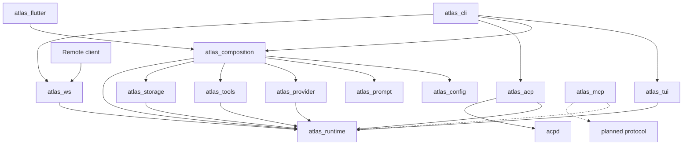

# Architecture

[中文](zh-CN/architecture.md)

> **Status:** `atlas_runtime`, `atlas_storage`, the `atlas_provider`
> adapters, `atlas_config` loading, the built-in `atlas_tools`, `atlas_prompt`
> prompt construction, `atlas_composition`, the `atlas_tui` Nocterm chat
> interface, the ACP server adapter (`atlas_acp`, served by `atlas acp`), and
> local Flutter runtime composition, the WebSocket transport (`atlas_ws`),
> the `atlas server` entry point, and the mobile remote client are
> **Available**. The MCP adapter remains **Planned**.

## System Shape

Atlas uses one Dart runtime implementation with local application composition
roots and optional remote transports. No presentation or protocol adapter owns
a separate agent loop.

```mermaid
graph TD
    CLI[atlas_cli] --> TUI[atlas_tui]
    CLI --> COMP[atlas_composition]
    CLI --> ACP[atlas_acp]
    CLI --> WS[atlas_ws]
    FL[atlas_flutter] --> COMP
    COMP --> CONFIG[atlas_config]
    COMP --> PROMPT[atlas_prompt]
    COMP --> PROVIDER[atlas_provider]
    COMP --> TOOLS[atlas_tools]
    COMP --> STORAGE[atlas_storage]
    COMP --> RT[atlas_runtime]
    TUI --> RT
    ACP --> RT
    REMOTE[Remote client] --> WS
    WS --> RT
    MCP[atlas_mcp] -.-> RT
    PROVIDER --> RT
    TOOLS --> RT
    STORAGE --> RT
    ACP --> ACPD[acpd]
MCP -.-> JRPC[planned protocol]
```

The MCP component and edges above appear for target-state context; they are
not wired in code yet.

`atlas_composition` composes one runtime from `atlas_config`, providers,
storage, tools, and the system prompt builder. `atlas_cli` and `atlas_flutter`
use this shared composition from their own process bootstraps.
Running `atlas` enters the Nocterm TUI by default. Running `atlas acp`
serves the composed runtime to ACP clients (editors such as Zed) over NDJSON
stdio. The Flutter app is always an ACP client: local mode starts an
in-process `AcpServer` over an in-memory transport, and remote mode spawns a
third-party ACP agent through `acpd_io`. Nocterm still talks to the runtime
directly. `atlas server` exposes the composed runtime handler through
`atlas_ws` for remote clients: the Atlas mobile app (and any ACP client)
connects over a WebSocket where each text frame carries one ACP JSON-RPC
message, guarded by a bearer token; turns started on a connection keep running
when the socket drops and are recovered through `session/load` after
reconnection. ACP is an inbound adapter to the same runtime; MCP primarily
connects external tools to the tool layer.

### CLI Shutdown Ownership

The CLI command runner parses arguments before creating adapters. Each running
command owns its storage and HTTP client, composed through `atlas_composition`.
On process shutdown it stops accepting work, calls `AgentRuntime.shutdown()`
to cancel and drain active/queued turns and compactions, waits for protocol
handlers, and closes adapter resources. Event consumers keep draining during
shutdown so terminal persistence boundaries are completed. A normal WebSocket
disconnect still lets existing turns finish; process shutdown is distinct.
Nocterm bootstrap and terminal cleanup remain in `atlas_tui`; that bootstrap
returns naturally instead of allowing Nocterm to terminate the process.

## Package Responsibilities

| Package | Responsibility |
|---|---|
| `atlas_runtime` | Session/turn domain models, ordered timeline items, model/tool ports, the single agent engine, cancellation, compaction, and skills |
| `atlas_storage` | Drift persistence for sessions, turns, and typed timeline messages, with provider continuations and the compaction checkpoint embedded in their owning rows, plus queries |
| `atlas_provider` | OpenAI-compatible Chat Completions and Responses plus Anthropic Messages adapters: authentication, request mapping, SSE decoding, retries, and response conversion |
| `atlas_config` | YAML schema, loading, validation, and mapping of `~/.atlas/config.yaml` onto provider configuration objects |
| `atlas_tools` | Built-in tool implementations with structured calls and results |
| `atlas_prompt` | System prompt construction: operating template, tool listing, `~/.atlas/AGENTS.md` and working-directory `AGENTS.md` loading, and platform/shell/date context |
| `atlas_ws` | Versioned WebSocket wire contract and transport: the `/acp` upgrade endpoint, bearer-token authorization, connection and frame policies, and per-connection `AcpServer` lifecycle over the shared runtime |
| `atlas_acp` | ACP server adaptation to the shared runtime |
| `atlas_mcp` | Planned: MCP client first, with server support deferred until needed |
| `atlas_tui` | Nocterm chat interface over an injected runtime interface: message transcript, input bar, and turn status |
| `atlas_composition` | Shared application composition for configured providers, tools, storage, prompts, and the single runtime |
| `atlas_cli` | Composition root for the default TUI and other CLI commands; delegates runtime construction to `atlas_composition` |
| `atlas_flutter` | Desktop and mobile ACP client; remote WebSocket mode is planned; the theme preference is client-local (`shared_preferences`) |

## Dependency Rules

- `atlas_runtime` owns domain models and ports but has no dependency on Flutter, storage, providers, tools, or transports.
- Storage, provider, and tool packages depend on and implement runtime ports; adapters do not own orchestration.
- Provider-specific request fields remain in `atlas_provider`.
- `atlas_provider` selects a configured endpoint by `ModelRef`; its public configuration is programmatic and does not define CLI or configuration-file parsing.
- OpenAI and Anthropic providers share `HttpStreamClient` for retries, timeouts, and cancellation, and `decodeSse` for SSE framing. `CompositeModelProvider` routes requests by provider identifier so several providers share one runtime instance.
- Streaming failures are emitted as one terminal runtime event. Retries happen only before the first streamed event; cancellation is bridged to Dio's `CancelToken`.
- `atlas_ws` owns an explicit versioned wire schema and the transport behavior; it does not compose runtime services.
- Local presentation code receives runtime interfaces directly. Only application bootstrap code constructs provider, tool, and storage adapters; both application roots use `atlas_composition`.
- `atlas_prompt` depends on `atlas_runtime` public types only and is consumed by composition roots through `buildSystemPrompt`.
- `atlas_cli` and `atlas_flutter` are separate process composition roots and share construction code, not runtime instances.
- ACP owns its protocol lifecycle through `acpd`; `atlas server` reuses the same `AcpServer` per WebSocket connection. MCP is Planned and has no implementation package yet.

## Flutter Client State

Flutter keeps Riverpod controllers under each feature's `application` directory.
The `remote_connection` controller receives ACP subprocess and WebSocket connector
functions from `app`; feature code does not import the runtime bootstrap. The
working-directory provider lives in `shared/application`, so connection selection
and workspace drafts do not depend on each other's controllers.

Saved ACP and remote profiles use shared repositories that serialize list updates
and publish immutable snapshots after successful writes. Views call controller
commands rather than reading or replacing stored lists. Each file browser has its
own auto-disposed controller for directory caches, debounced watches, previews,
and file operations. `FileBrowserService` owns filesystem access; widgets keep
menus, dialogs, and the Markdown preview toggle.

## Runtime Contracts

The runtime implementation and remaining adapters must preserve these
product-level contracts:

- Each model tool call receives one model-visible result in the original order, including failures.
- `AgentEvent` values are emitted in occurrence order so clients do not regroup output after a turn.
- Tool output snapshots are transient replacement events (`ToolOutputUpdated`), coalesced for slow consumers. They never enter the durable timeline or model context; each invocation still produces exactly one final tool result.
- Cancelling a runtime event subscription requests cooperative turn cancellation and waits for paired tool results and the terminal turn to be persisted before releasing the session lock.
- A `Session` contains ordered `TimelineItem` values and durable `Turn` records. User input is persisted atomically with a running turn before the first provider request.
- Every assistant message may carry a provider-owned `ModelContinuation`; it is persisted inside the assistant row and restored onto the corresponding provider-neutral message.
- Cancellation before a turn starts creates no timeline item. Cancellation after user input reaches the runtime preserves the interrupted turn boundary: text already received from an interrupted model stream is persisted as an aborted assistant message and participates in later model context.
- Skill injection preserves the original user text in history. Full skill instructions are turn-scoped model context, not transcript content.
- Model requests stay prefix-stable so providers can reuse the prefix cached by earlier requests: the system prompt is rebuilt from the frozen session context with the operating context last, the timeline projection only appends, and skill instructions are appended after the projected history.
- Anthropic requests mark cache breakpoints on the last tool, the system prompt, and the last cacheable message block; OpenAI-compatible requests always send the session identifier as `prompt_cache_key`. `atlas cache` reports token reuse and request-hit rates with measurement coverage from the session database, independently of context compaction. Provider adapters normalize complete input counts and record cache-field availability on assistant usage; reporting never infers historical accounting from current configuration. Legacy and aborted usage is excluded from rates, and summary calls are outside the recorded-response scope.
- Compaction preserves the durable timeline while replacing the active context checkpoint, which is stored on the session row. The runtime keeps the newest whole turns verbatim, summarizes everything earlier, and projects the summary into the model request as the leading user message, wrapped in `<context_summary>` with `Context compacted. Kept {n} recent messages.`; the system prompt is unaffected. An optional compact instruction changes the generated summary, not user history. Manual compaction summarizes with the session's selected model, falling back to the model of the last turn.

These contracts define expected behavior, not compatibility with the removed Go implementation or its database schema.

## Local Security Boundary

Atlas tools run with the permissions of the local Atlas process. The product does not provide a sandbox, permission prompts, or an approval gate. Protocol adapters must not imply a stronger security boundary than the runtime provides.
