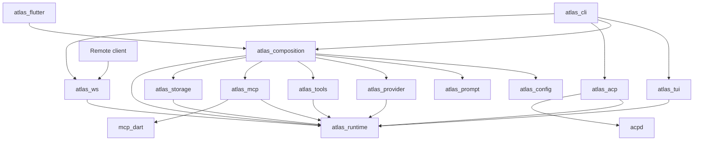

# Architecture

[中文](zh-CN/architecture.md)

> **Status:** Every package, client, and transport described here is **Available**. Boundaries that are not shipped yet are marked **Planned**.

## System Shape

Atlas has one Dart runtime with local composition roots and optional remote transports. No presentation or protocol adapter owns a second agent loop.

```mermaid
graph TD
    CLI[atlas_cli] --> TUI[atlas_tui]
    CLI --> COMP[atlas_composition]
    CLI --> ACP[atlas_acp]
    CLI --> WS[atlas_ws]
    FL[atlas_flutter] --> COMP
    COMP --> CONFIG[atlas_config]
    COMP --> PROMPT[atlas_prompt]
    COMP --> PROVIDER[atlas_provider]
    COMP --> TOOLS[atlas_tools]
    COMP --> MCP[atlas_mcp]
    COMP --> STORAGE[atlas_storage]
    COMP --> RT[atlas_runtime]
    TUI --> RT
    ACP --> RT
    REMOTE[Remote client] --> WS
    WS --> RT
    MCP --> RT
    PROVIDER --> RT
    TOOLS --> RT
    STORAGE --> RT
    ACP --> ACPD[acpd]
    MCP --> MCPSDK[mcp_dart]
```

`atlas_composition` builds one runtime from config, providers, storage, tools, and the system prompt. `atlas_cli` and `atlas_flutter` share that code from their own bootstraps but never share a runtime instance.

Running `atlas` enters the Nocterm TUI, which talks to the runtime directly. `atlas acp` serves the runtime to ACP clients (editors such as Zed) over NDJSON stdio, and `atlas server` exposes the same ACP surface over WebSocket for remote clients: each text frame carries one JSON-RPC message, guarded by a bearer token. The Flutter app is always an ACP client, with an in-process `AcpServer` over an in-memory transport in local mode and a third-party agent spawned through `acpd_io` in remote mode. Turns started on a WebSocket connection keep running when the socket drops and are recovered with `session/load` after reconnection.

`composeTools` connects configured MCP servers and freezes their tool catalog before `composeRuntime` receives the combined registry. MCP is a client adapter that brings external tools into the tool layer; ACP session-level MCP configuration remains Planned.

### CLI shutdown

Each CLI command owns the storage and HTTP clients it composes. On shutdown it stops accepting work, calls `AgentRuntime.shutdown()` to cancel and drain active turns and compactions, waits for protocol handlers, and closes adapter resources while event consumers keep draining so terminal persistence completes. Nocterm bootstrap and terminal cleanup stay in `atlas_tui`, and that bootstrap returns naturally instead of terminating the process.

## Package Responsibilities

| Package | Responsibility |
|---|---|
| `atlas_runtime` | Session and turn domain models, ordered timeline, model/tool ports, the agent engine, cancellation, compaction, skills |
| `atlas_storage` | Drift persistence for sessions, turns, and typed timeline messages, plus queries |
| `atlas_provider` | OpenAI-compatible Chat Completions and Responses plus Anthropic Messages: authentication, request mapping, SSE decoding, retries, response conversion |
| `atlas_config` | Pi-shaped `settings.json`, `models.json`, and `mcp.json` loading, validation, and model override resolution |
| `atlas_tools` | Built-in tools with structured calls and results |
| `atlas_prompt` | System prompt construction, including `~/.atlas/AGENTS.md` and working-directory instruction files |
| `atlas_ws` | Versioned WebSocket wire contract and transport for the `/acp` endpoint |
| `atlas_acp` | ACP server adaptation to the shared runtime |
| `atlas_mcp` | MCP client connections, discovery, tool and result mapping, cancellation, and cleanup through `mcp_dart` |
| `atlas_tui` | Nocterm chat interface over an injected runtime interface |
| `atlas_composition` | Shared composition of providers, tools, storage, prompt, and the single runtime |
| `atlas_cli` | Composition root for the TUI and the other CLI commands |
| `atlas_flutter` | Desktop and mobile ACP client; client-local preferences use `shared_preferences` |

## Dependency Rules

- `atlas_runtime` owns domain models and ports and depends on no storage, provider, tool, UI, or transport implementation.
- Storage, provider, and tool packages implement runtime ports; adapters do not own orchestration. Provider-specific request fields stay in `atlas_provider`.
- `atlas_provider` selects an endpoint by `ModelRef`. OpenAI and Anthropic adapters share `HttpStreamClient` and `decodeSse`; `CompositeModelProvider` routes by full model reference so a relay can use a different API and endpoint for each model. Streaming failures surface as one terminal event, retries happen only before the first streamed event, and cancellation is bridged to Dio's `CancelToken`.
- `atlas_ws` owns the versioned wire schema and transport behavior without composing runtime services.
- Only application bootstrap code constructs adapters; both application roots use `atlas_composition`, and `atlas_prompt` depends on `atlas_runtime` public types only.
- ACP owns its protocol lifecycle through `acpd`; `atlas server` reuses one `AcpServer` per connection. MCP uses `mcp_dart` inside `atlas_mcp`, and SDK HTTP dependencies stay in that adapter.

## Model Configuration and Authentication

`atlas_config` resolves an immutable startup snapshot from settings, custom models, and MCP documents. `atlas_provider` supplies bundled/cached models.dev metadata for supported built-ins and owns request-time authentication, custom headers, and compatibility behavior. `models` entries add or replace definitions; `modelOverrides` merges metadata after the catalog. Unsupported protocol options fail during loading. Provider keys are names for services, including arbitrary relays, with no separate connection identity.

Saved API keys live in `auth.json`, with serialized and file-locked atomic updates. Each request re-reads the selected credential and evaluates configured environment/command references; listing models does not execute credential commands. Catalog refresh validates before replacing the disposable cache, and corrupt caches fall back to the bundle. Configuration and catalog changes take effect after restarting the host; saved-key changes take effect on the next request. SQLite continues to own session records and never becomes a second source of provider configuration.

ACP model options carry versioned `atlas.dev` metadata for context/output limits, input modalities, and reasoning choices. Atlas clients retain these fields when rebuilding catalogs after session updates; third-party ACP options without the extension remain supported.

## Flutter Client State

Flutter groups product code by feature: `settings`, `connections`, `workspace`, `files`, and `terminal`. Each feature owns its `presentation` widgets and Riverpod `application` controllers, with `data` only where a plugin, filesystem, or storage adapter is needed; shared layout and window code lives in `shared`. Riverpod `Notifier` and `AsyncNotifier` own application state, while animations, focus, and menus stay in widgets, and feature presentation code never imports bootstrap or concrete storage adapters. The workspace controller exposes model, mode, and command catalogs as immutable UI state, so the composer does not query the runtime, and the working-directory provider in `shared/application` is shared by connection selection and workspace drafts.

On macOS the app resolves the user's exported login-shell environment once before local bootstrap, and configuration substitution, the shell tool, and ACP subprocesses receive that snapshot; `Platform.environment` is never mutated and shell commands still run under `/bin/sh -c`. Resolution is time- and size-bounded, and any failure keeps the inherited environment.

Saved ACP and remote profiles use repositories that serialize updates and publish immutable snapshots. Each file browser has an auto-disposed controller for caches, watches, previews, and file operations, with filesystem access behind `FileBrowserService`. Terminal panels use an injected session port, and the shared process registry kills live shells on exit.

Layouts adapt to the available width: windows at least 960 logical pixels wide show side panels or a section rail anywhere, including Android and iOS, while smaller windows use drawers or a strip, and touch targets stay larger on mobile. The `go_router` tree nests `/settings` under `/`, and Android and iOS register the `atlas:///` deep links. HTTPS App Links and Universal Links are Planned.

## Runtime Contracts

The runtime and every adapter preserve these product-level contracts:

- Every model tool call receives one model-visible result in the original order, including failures, and `AgentEvent` values are emitted in occurrence order so clients never regroup output.
- Tool output snapshots (`ToolOutputUpdated`) are transient replacements, coalesced for slow consumers. They never enter the durable timeline or model context, and each invocation still produces exactly one final result.
- Cancelling an event subscription requests cooperative turn cancellation and waits for paired tool results and the terminal turn to be persisted before releasing the session lock.
- A `Session` holds ordered `TimelineItem` values and durable `Turn` records. User input is persisted atomically with a running turn before the first provider request, and every assistant message may carry a provider-owned `ModelContinuation` that is stored inside the assistant row and restored onto the provider-neutral message.
- Cancellation before a turn starts creates no timeline item. Text already received from an interrupted stream is persisted as an aborted assistant message and participates in later model context.
- Skill injection keeps the original user text in history; full skill instructions are turn-scoped model context, not transcript content.
- Model requests stay prefix-stable: the system prompt is rebuilt from the frozen session context with the operating context last, the timeline projection only appends, and skill instructions are appended after the projected history. Anthropic requests mark cache breakpoints on the last tool, the system prompt, and the last cacheable message block, while OpenAI Responses and official OpenAI Chat Completions requests send the session identifier as `prompt_cache_key`, and compatible relays can opt into session-affinity headers; `atlas cache` reports reuse from the session database without inferring historical accounting from current configuration.
- Compaction keeps the durable timeline and replaces the active context checkpoint on the session row. The runtime keeps the newest whole turns verbatim, summarizes the rest into a leading `<context_summary>` user message, and never splits an assistant/tool/result group. An optional compact instruction changes only the summary, and manual compaction uses the session's selected model or the model of the last turn.

These contracts describe expected behavior, not compatibility with the removed Go implementation or its database schema.

## Local Security Boundary

Atlas tools run with the permissions of the local Atlas process, with no sandbox, permission prompts, or approval gate. Protocol adapters must not imply a stronger boundary than the runtime provides.
