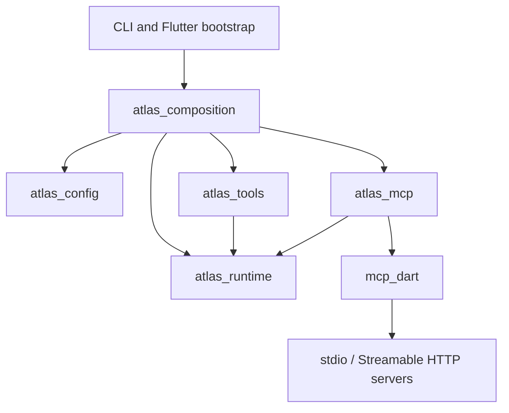

# MCP client support — development plan

[中文](../zh-CN/plans/mcp-support.md)

> Status: **Implemented (core phases 0–4)**. SDK: `mcp_dart` 2.4.2. stdio and Streamable HTTP with static headers are implemented. OAuth and session-scoped ACP configuration remain follow-up work. See [MCP tools](../mcp.md) for the current user contract; the design below records the implementation plan.
>
> Delivery decisions: automatic subprocess/HTTP reconnect is disabled; stale HTTP sessions cannot trigger tool-call replay and require restart. The SDK's native HTTP buffer is not byte-limited by Atlas; the 50 KiB result limit applies after decoding. Generic ACP titles are now preserved for live and replayed MCP tools. The planned DTOs, owned async composition, two transports, deadlines, cancellation, redacted errors, catalog freezing and text/JSON mapping are implemented. Review follow-ups are implemented too: catalog metadata is bounded, an HTTP deadline abandons its connection instead of leaking one request per attempt, and the Flutter exit path releases the active runtime with a bounded wait.

## 1. Goal and delivery scope

Let the existing Atlas agent discover and call tools exposed by configured MCP servers. The same tools must work through the CLI TUI, `atlas acp`, `atlas server`, and Flutter desktop local mode. Mobile and remote clients use the MCP connections owned by the computer running Atlas.

The core delivery has two milestones: local **stdio** tools first, then remote **Streamable HTTP** tools with static headers, including bearer tokens. Completing both milestones constitutes the initial scope of this plan. Configuration lives in `~/.atlas/config.yaml`; configuration changes take effect after restart.

| Capability | Delivery |
|---|---|
| Multiple configured servers, tool discovery and calls | Core |
| stdio subprocess transport | First milestone |
| Streamable HTTP, unauthenticated or static header authentication | Second milestone |
| Text and structured JSON results, errors, timeouts, cancellation | Core |
| Existing tool events, persistence, replay, generic tool display | Core |
| OAuth browser login, token storage and refresh | Follow-up |
| Dynamic tool catalog refresh and connection management UI | Follow-up |
| ACP-provided, session-scoped `mcpServers` | Follow-up |
| MCP resources, prompts, roots, sampling, elicitation, Tasks and Apps | Follow-up |
| Image/audio tool results passed to models | Follow-up |
| Atlas acting as an MCP server; legacy HTTP+SSE transport | Outside core scope |

Do not advertise optional client capabilities whose Atlas-side behavior is not implemented. SDK support alone does not constitute product support. OAuth servers that cannot accept a configured token require the follow-up authentication work.

## 2. Current code and constraints

| Existing location | Integration implication |
|---|---|
| `packages/atlas_runtime/lib/src/ports/tool_registry.dart` | `Tool` and `ToolRegistry` already describe and execute external tools. |
| `packages/atlas_runtime/lib/src/domain/timeline.dart` | `ToolResult.content` is text; metadata is JSON. Binary/multimodal results need an explicit conversion policy. |
| `packages/atlas_runtime/lib/src/agent/turn_executor.dart` | Tool descriptors are read for each model request; exceptions become paired results. Preserve these guarantees. |
| `packages/atlas_tools/lib/src/local_tool_registry.dart` | A single immutable registry can hold built-in tools and MCP tool wrappers. No composite registry is necessary for core scope. |
| `packages/atlas_composition/lib/src/runtime_composer.dart` | Synchronous composition already accepts an injected registry and uses it in the system prompt. Discover tools before composing the runtime. |
| `apps/atlas_cli/lib/src/runtime_resources.dart` | The synchronous resource constructor needs an asynchronous creation path for MCP. |
| `apps/atlas_flutter/lib/app/runtime_environment.dart` | Bootstrap is asynchronous already; shutdown and partial-startup cleanup must also own MCP resources. |
| `packages/atlas_acp/lib/src/acp_server.dart` | Nonempty `mcpServers` is currently rejected. Global config support does not implement this separate session-level contract. |

`atlas_runtime` remains protocol-independent. All adapters use its single agent loop. Atlas retains its local-process permission model without adding approval prompts or a sandbox. Working directories and future MCP roots are context, not filesystem access restrictions.

## 3. SDK and package boundary

Use `mcp_dart`; the published **2.4.2** archive was inspected for this plan. Its Dart constraint is `^3.4.0`, compatible with Atlas's `^3.13.0` baseline. Relevant published APIs include:

- `McpClient`, `McpClientOptions` and `McpProtocol.stable` for negotiated protocol behavior, including initialization-era fallback.
- `StdioClientTransport` / `StdioServerParameters` for subprocesses, environment, working directory, message limits and cleanup.
- `StreamableHttpClientTransport` / `StreamableHttpClientTransportOptions` for remote endpoints and static headers through `requestInit`.
- `listTools`, `callTool`, `RequestOptions.signal`, `timeout`, `maxTotalTimeout` and `onprogress` for tool discovery and execution.

The user authorized `package:http` as an MCP dependency. Use the SDK's HTTP implementation directly; do not replace it with a Dio transport. Atlas's model providers and other HTTP integrations continue to use Dio. Record this exception in `AGENTS.md` and in the future `atlas_mcp/README.md`.

Create `packages/atlas_mcp` when implementation starts. It depends on `atlas_runtime` and `mcp_dart`, owns connections and protocol mapping, and exposes only Atlas-owned types at its public boundary. Use an import prefix for SDK types that overlap Atlas names such as `Tool` and `ToolResult`.

Configuration DTOs belong to `atlas_config`; composition maps them to `atlas_mcp` connection options. Neither package needs to import the other. `atlas_mcp` must not own YAML loading, providers, storage, agent orchestration or UI. `atlas_tools` continues to own built-in implementations and its registry.

Add `mcp_dart` from `packages/atlas_mcp` with `dart pub add` at its first real import, then commit the resolved workspace lockfile. Add other direct dependencies only where implementation imports them. Do not add dependencies in advance of a milestone that uses them. Lock and test the actual resolved SDK version; do not base code on unreleased GitHub examples.

## 4. Proposed configuration contract

The following is a schema design, not currently supported configuration. Introduce an optional `mcp_servers` list, defaulting to empty. Preserve file order.

| Field | Meaning and proposed default |
|---|---|
| `name` | Required, unique server identifier; `[A-Za-z0-9_-]+`. |
| `transport` | Required discriminator: `stdio` or `streamable_http`. |
| `enabled` | Boolean, default `true`; disabled entries never open connections. |
| `startup_timeout_seconds` | Positive integer, default `15`; covers connection and all discovery pages for one server together. |
| `call_timeout_seconds` | Positive integer, default `60`; hard total deadline for each tool invocation. |
| `command`, `args` | stdio only; nonempty executable plus a list of strings, no shell command parsing; `args` defaults to empty. |
| `cwd` | stdio only; optional absolute path, with leading `~/` expansion. Omitted means the captured Atlas process startup directory. |
| `env` | stdio only; string overrides on the bootstrap environment snapshot; defaults to empty. |
| `url` | HTTP only; absolute HTTP(S) endpoint without userinfo or fragment; preserve any query but redact it in diagnostics. |
| `headers` | HTTP only; string map, default empty; supports static bearer tokens. |

Expand `${VAR}` in `env` and `headers` values using the same environment supplied to existing config loading. Report missing variables by field path and variable name without printing values. Disabled entries still receive structural validation, but skip secret substitution and I/O, so disabling an integration does not require its credentials. Reject transport-incompatible fields, invalid types, duplicate names, invalid header names/line breaks and SDK-owned protocol header overrides. Bound duration parsing to values representable by Dart `Duration`.

Pass the merged environment explicitly to stdio and set `includeParentEnvironment: false`: the bootstrap snapshot already contains the inherited environment. On macOS Flutter this preserves the resolved login-shell `PATH`. Do not invoke a shell or auto-install executables. Explicitly configured `cwd` applies to the server process; switching an Atlas session directory does not change that process's directory. Credentials for remote clients stay on the Atlas host. A remote Flutter client does not apply its own MCP config to another agent.

During the stdio milestone, reject `streamable_http` as not yet implemented. Enable its branch only with the HTTP milestone. No planned configuration example belongs in the active configuration guide before its implementation is available.

## 5. Connection and composition lifecycle

Use one connection per enabled server per composed runtime. All sessions of that runtime share these connections and an immutable tool catalog. Do not change roots or a server's working directory to match whichever session last called it.

Add an asynchronous `composeTools` helper in `atlas_composition`, returning an owned tool set with a `ToolRegistry` and idempotent `close()`. It constructs built-in tools, connects MCP servers, wraps discovered tools and returns one `LocalToolRegistry`. Reuse the existing built-in construction internally; keep `composeRuntime` synchronous and pass the prepared registry via `tools:`. The application still owns when to start and stop resources.

Startup behavior:

1. Parse config and capture environment and startup directory without opening MCP connections for `--help`, `--version` or `atlas cache`.
2. Connect enabled servers and discover all tool pages in deterministic config order. Each server has one overall startup deadline; detect repeated cursors.
3. Validate the catalog, then expose the completed runtime to its consumers.
4. If any enabled server fails, report its name and a safe failure category, fail startup, and close every resource already opened, including the failing connection. Empty `mcp_servers` preserves the current local startup behavior.

The SDK owns version negotiation. Begin with the explicit `McpProtocol.stable` profile and verify legacy fallback in phase 0. Atlas does not implement its own JSON-RPC stack. Use SDK transport recovery only after its behavior is tested; ordinary calls with uncertain outcomes must not be replayed. Event-stream resume is distinct from re-executing a tool. After a new connection is established, revalidate the catalog before accepting further calls; a changed catalog requires an Atlas restart in core scope. Do not add an application-level retry loop.

Shutdown stops new work, cancels and drains runtime turns, lets ACP/event consumers finish, then closes MCP connections before closing provider HTTP clients and storage. Keep consumers draining while turns finish. All cleanup runs even if an earlier close fails; report incomplete cleanup without exposing raw exceptions. Startup deadlines must close pending transports, including a process that appears after the deadline; timing out a `Future` alone is insufficient.

CLI TUI, ACP and server commands must await resource creation and handle signals during startup. Flutter local bootstrap must await cleanup after failed ACP connection and explicitly shut down the local runtime before releasing adapters. Normal remote ACP/WebSocket disconnection still allows host turns to finish.

## 6. Tool mapping and model-visible behavior

### Catalog and names

Map every supported advertised tool to an Atlas `Tool` wrapper. Preserve the input JSON Schema and description, with the original server/tool identity available for diagnostics. Reject malformed schemas; do not silently flatten or weaken them. Exercise representative schemas through all three provider request formats.

Generate deterministic provider-compatible names using ASCII letters, digits, underscores and hyphens, with a maximum of 64 characters. Use a readable server and tool prefix plus a stable digest of the original pair; never use Dart `hashCode`. Detect collisions after encoding and never silently overwrite a tool. Keep the original name in the dispatch map and use it for `tools/call`. Sort tools by original name within each configured server and retain the current built-in order, so connection timing cannot change model context.

Core scope freezes the catalog at startup, and its metadata is bounded: descriptions are truncated at 2 KiB, a tool schema above 64 KiB and a per-server catalog above 1 MiB fail startup. Record list-change notices as a bounded "restart required" diagnostic without mutating model schemas mid-turn. Handle both legacy notifications and the SDK's negotiated subscription mechanism where needed. Do not automatically incorporate server instructions into the system prompt or claim support for tools requiring optional Tasks execution.

### Calls and results

- Forward arguments unchanged to the selected server/tool. One Atlas call still produces exactly one final result, including transport errors.
- Preserve ordered text content. Serialize `structuredContent` into the model- visible text as JSON when present, including scalar/array values from negotiated newer protocols. It must not exist only in metadata invisible to the model.
- Render embedded text resources and resource-link URIs as bounded text; do not fetch links automatically. Replace binary image/audio/resource data with an explicit omitted-content marker. If a successful response contains only unsupported binary content, return an adapter error explaining that limitation. A genuinely empty successful result remains a valid empty result.
- Preserve MCP `isError`. Convert protocol, authentication, disconnected-server, timeout and cancellation failures to safe, distinct summaries. Server-supplied tool text remains tool output; do not replace it with raw SDK exceptions or logs.
- Cap persisted/model-visible output at **50 KiB of UTF-8**, including a truncation marker. Metadata must also be bounded and must not retain a second unbounded result or base64 blobs. Retain server/tool identity, truncation and failure kind; store structured JSON only within the same aggregate result budget.
- Use existing transient `ToolOutputSnapshot` events for bounded textual progress where supplied. Do not persist progress or inject it into model context. Ignore late progress after the final result.

Atlas's model and timeline tool outputs remain text-only in core scope; no storage migration is needed. A later multimodal implementation must extend domain types, storage, provider projection and client presentation together.

### Cancellation and failures

Bridge `ToolContext.cancellation` to the SDK abort signal for that request. Handle already-cancelled calls and clean up the bridge on completion. Apply a hard total call deadline even when progress keeps arriving. Cancelling one call must not cancel another session's call. Cancellation ends Atlas's wait and sends the negotiated cancellation signal where supported; it cannot guarantee that a remote side effect was undone. Shipped exception: a Streamable HTTP deadline or cancellation marks that connection unusable (`connection_abandoned`) and closes it in the background, because SDK 2.4.2 cannot abort an in-flight request and each further attempt would leak another one. stdio connections stay usable.

If a request loses its response after the server may have acted, report the uncertain outcome. Do not retry based on `readOnlyHint` or `idempotentHint` alone. Verify SDK recovery with a counter tool to catch accidental duplicate execution.

Capture stdio stderr rather than forwarding arbitrary child output into ACP stdout or the TUI. Drain it with bounds; route safe categories through the existing logger. Do not log configured environment/header values, full authentication URLs, raw protocol bodies or arbitrary SDK error strings. Keep the SDK's stdio message limit; measure and document HTTP buffering limits separately from the final-result cap.

## 7. Delivery phases and review units

| Phase | Work | Exit criterion |
|---|---|---|
| 0 — SDK integration probe | Use the published SDK with controlled stdio and local HTTP peers; verify protocol fallback, headers, pagination, abort, startup cleanup, reconnect/replay behavior and HTTP buffering. Keep useful probes as integration fixtures. | Confirm required public APIs and resolve lifecycle uncertainties before production wiring. If SDK behavior breaks a contract, fix it or narrow the stated support; do not silently ship the violation. |
| 1 — Configuration and stdio adapter | Create `atlas_mcp`, package README, workspace membership and actual dependencies; add stdio config, connection management, wrappers, conversion and targeted tests. | Tools can be discovered and executed through a registry with success, error, timeout and cancellation paths. |
| 2 — Shared composition and entry points | Add owned async tool composition; wire all CLI runtime entry points and Flutter local bootstrap; fix resource cleanup on failed/partial startup. | The stdio milestone works from TUI, ACP, server and Flutter with paired persisted results and no owned-process leak on exit. |
| 3 — Streamable HTTP | Enable HTTP config, static headers and SDK transport; test both JSON and SSE responses and negotiated legacy/modern paths. | Local test endpoints work without auth and with a bearer header; 401/403, disconnect and timeout are visible without exposing tokens or duplicating calls. |
| 4 — Cross-client verification and docs | Verify generic tool rendering/replay, concurrency, shutdown and provider schema projection; update current-status docs and Chinese translations. | Core acceptance matrix passes; publish only implemented behavior and limitations. |

Phase 0 informs both transports; phase 3 follows the completed stdio milestone. Keep phases as reviewable changes with focused tests. The config DTOs, connection owner and tool wrapper are the necessary new abstractions; avoid an SDK-neutral framework or provider-specific MCP execution paths.

Expected implementation locations:

- New `packages/atlas_mcp`: public options/connection owner, internal stdio/HTTP construction, tool wrapper, result conversion and integration fixtures.
- `atlas_config`: configuration DTOs, parser and field-level validation tests.
- `atlas_composition`: async tool assembly and ownership, plus its README.
- `apps/atlas_cli`: resources, TUI/ACP/server startup and lifecycle tests.
- `apps/atlas_flutter/lib/app`: local bootstrap and teardown, plus bootstrap tests.
- Root workspace manifest/lockfile and bilingual architecture, configuration, tools and product-status documentation when each capability becomes available.

`atlas_runtime`, providers and storage should need no MCP-specific production logic. Change generic client rendering only if verification finds a real problem. Update the ACP rejection explanation to clarify the remaining session-config limitation, but retain the explicit rejection of nonempty `mcpServers`.

## 8. Acceptance and verification

| Boundary | Required observable result |
|---|---|
| Config | Empty/disabled config starts normally; invalid variants, missing enabled secrets, duplicate names and duration overflow have field-specific errors. |
| Discovery | Multiple pages and servers map predictably; same-name/long-name/unusual-name tools stay distinct; malformed/repeated-cursor catalogs fail without leaking resources. |
| stdio | Resolved environment and `cwd` reach the process; stderr cannot corrupt ACP; start timeout, early exit and shutdown settle and close owned processes. |
| HTTP | JSON/SSE responses, static auth, 401/403, session loss and reconnect behavior match the advertised support; tokens are absent from diagnostics. |
| Invocation | Text, structured-only JSON, mixed content, empty result, MCP errors and oversized results produce the documented result. |
| Cancellation | A hanging stdio call ends within its deadline and its connection stays usable; a hanging Streamable HTTP call ends, marks that connection unusable with a restart hint, and issues no further requests on it. |
| Replay safety | A counter mutation followed by a lost response is not automatically applied a second time. |
| Runtime | Built-in plus MCP calls retain model order and exactly one persisted result each, including cancellation and tool failure. |
| Presentation | TUI and Flutter show generic MCP calls, progress and final errors; ACP `session/load` restores completed results. |
| Scope | ACP-provided `mcpServers` still yields an explicit unsupported error; remote clients use only host-configured tools. |
| Lifecycle | Failure of a later server closes earlier ones; failed Flutter ACP bootstrap closes MCP; process shutdown drains turns before storage closes. |

Run focused tests from the affected package first. Before implementation delivery, run `mise run ci`, `mise run cli-build`, and the applicable `mise run app-build-*` task for affected Flutter platform integration. Confirm the CLI artifact at `build/bundle/bin/atlas` and exercise a real stdio process and a local HTTP server through Atlas. Test fixtures must be self-contained and must not need production credentials, a paid model API, or downloading an external server at test time. A manual smoke test with an independently implemented MCP server complements these fixtures; record its version and transport.

## 9. Follow-up work and rollback

OAuth requires an explicit login entry point, callback ownership, token storage, refresh, logout and CLI/Flutter behavior. Build it around the SDK's auth provider APIs as a separate feature. Do not auto-open a browser during ordinary startup.

ACP session configuration, session roots and dynamic catalog refresh require a registry scoped by session and a stable tool snapshot shared by each model request and its prompt. Define precedence, lifetime, reconnection and session restore semantics before extending the current global `ToolRegistry`. Do not merely remove `_rejectMcpServers` or mutate a process-wide registry from one ACP connection.

Operational rollback is to disable affected MCP entries and restart Atlas. Code rollback removes adapter wiring and its dependencies; existing text tool history remains readable and requires no database migration.

## 10. References and evidence limits

- [Published mcp_dart 2.4.2](https://pub.dev/packages/mcp_dart/versions/2.4.2)
- [Published API documentation](https://pub.dev/documentation/mcp_dart/2.4.2/)
- [Package release metadata](https://pub.dev/api/packages/mcp_dart)
- [SDK repository](https://github.com/leehack/mcp_dart)
- [Atlas architecture](../architecture.md)
- [Atlas configuration](../configuration.md)
- [Atlas tool behavior](../tools.md)

Package capabilities above were checked against the published archive, not only its README. Implementation verification uses independent JSON-RPC fixture peers, with real stdio processes and local HTTP endpoints. It covers both 2025-11-25 and 2026-07-28, JSON/SSE, static/no authentication, cancellation, result bounds and replay safety. Runtime tests verify ordered persisted results; Flutter tests exercise HTTP tools through ACP and restore their history; CLI process tests verify stdio ownership and SIGTERM during startup. A compiled CLI smoke test also used an independent Python stdio peer and a local model endpoint to verify tool execution, persisted ACP replay and clean EOF exit. External-service credentials were not used. SDK conformance claims do not replace these Atlas integration tests.

Delivery checks passed: `mise run ci`, `mise run cli-build`, `mise run app-build-macos`, and `git diff --check`. CLI and macOS release artifacts were verified. The analyzer retains one pre-existing `unnecessary_import` info in `conversation_view_test.dart`; platform-specific test skips remain. Other platform release builds and third-party authenticated service accounts were not exercised.
