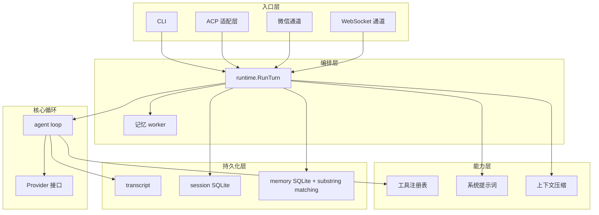
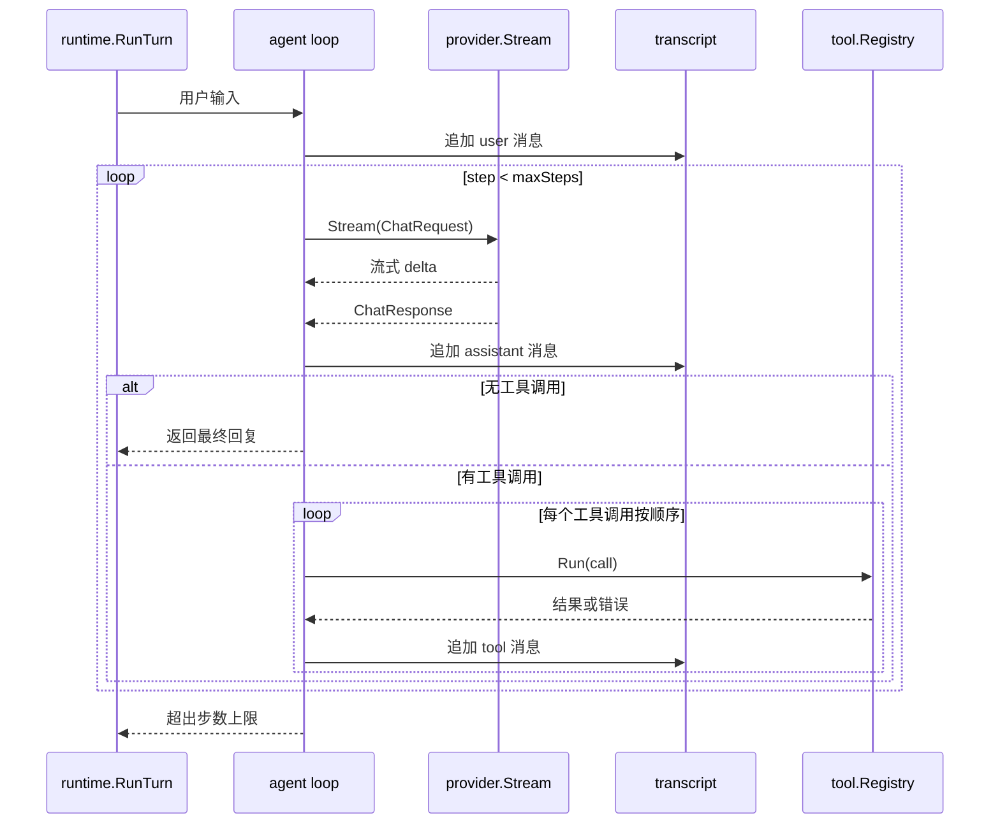

# 架构

[English](../architecture.md)

## 分层架构

Atlas 分为入口层、编排层、核心循环、能力层和持久化层。所有入口共享同一个 `runtime.Runtime`，核心 agent loop 保持纯粹无副作用。

## 核心循环

一次 turn 从用户输入开始：追加到 transcript，然后循环调用模型。模型返回文本增量时流式输出；返回工具调用时按顺序执行并把结果写回 transcript；没有工具调用或遇到错误时结束。

关键约束：

- 每个 tool call 都有配对的 tool result，顺序与模型返回一致。
- 工具错误作为模型可见的 tool result 写回，让模型可以据此调整。
- 没有 tool call、遇到错误或达到 `max_steps`（默认 20）时结束。

## 长期记忆

记忆系统通过后台 worker 异步工作。触发时机有三种：会话消息量达到增量阈值、用户明确要求记住某内容、或上下文压缩完成后。触发后入队抽取任务，worker 只处理上次边界后的新增消息，调用模型抽取记忆条目并写入数据库，随后刷新受影响作用域的摘要。相关记忆可通过 `memory_search` 工具按需检索，模型可调用该工具获取历史会话上下文。

记忆分三类：

- `instruction`：用户长期偏好或约束
- `fact`：项目事实
- `workflow`：可复用的项目操作流程

按 `global`（跨项目）和 `project`（按项目目录）两个作用域组织。

## 上下文压缩与 Todo

上下文压缩触发时，较早的消息会被摘要化，保留最近的消息继续对话。如果模型正在使用 `todo_write` 追踪任务，最后一次 todo 列表会从 transcript 中提取，未完成的条目会被注入摘要提示词。这样模型在压缩后仍能感知待办任务，无需将 todo 状态持久化到数据库。
