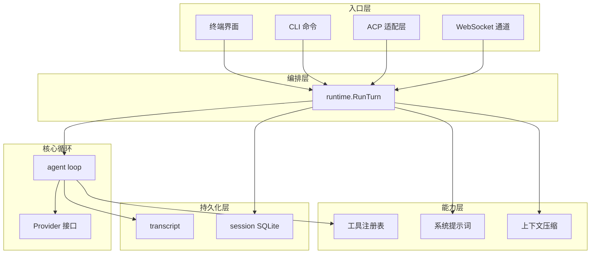
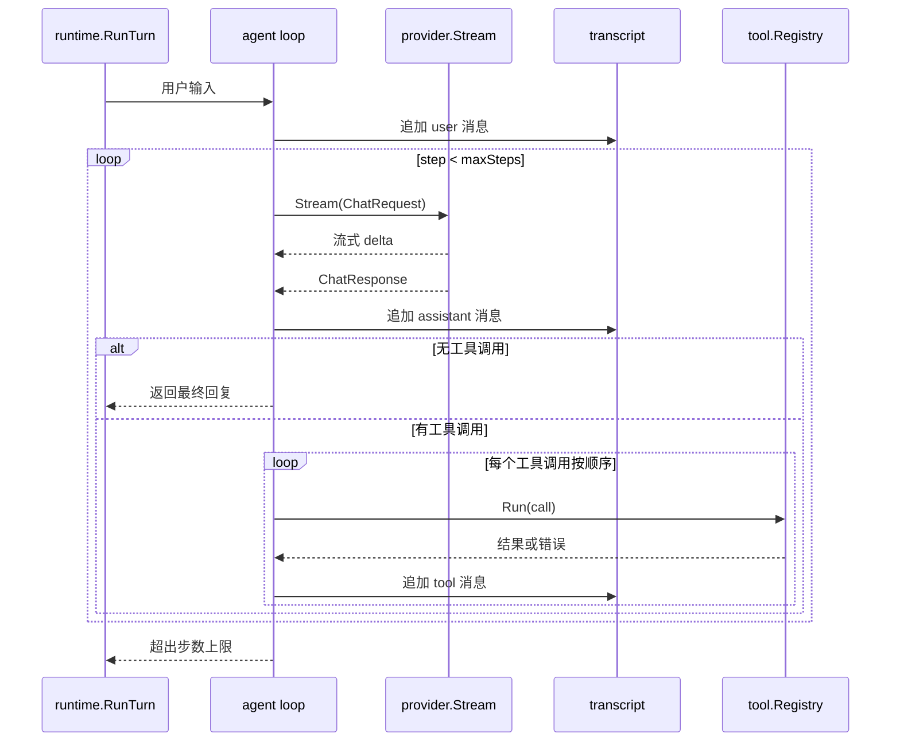

# 架构

[English](../architecture.md)

## 分层架构

Atlas 分为入口层、编排层、核心循环、能力层和持久化层。所有入口共享同一个 `runtime.Runtime`。核心 agent loop 保持 headless、依赖注入且可独立测试；配置、持久化和编排由 runtime 负责。

TUI 与 ACP、WebSocket 一样属于入口层适配。它把键盘和鼠标输入转换为运行时 turn，按顺序消费 observer 事件以展示流式输出和工具活动；编排和持久化仍由 `runtime.Runtime` 负责。

## 核心循环

一次 turn 从用户输入开始：追加到 transcript，然后循环调用模型。模型返回文本增量时流式输出；返回工具调用时按顺序执行并把结果写回 transcript；没有工具调用或遇到错误时结束。

关键约束：

- 每个 tool call 都有配对的 tool result，顺序与模型返回一致。
- 工具错误作为模型可见的 tool result 写回，让模型可以据此调整。
- observer 事件保持发生顺序，流式客户端可以依次展示模型输出、工具调用和 turn 完成事件，无需重新分组。
- 没有 tool call、遇到错误或达到 `max_steps`（默认 20）时结束。

## 上下文压缩与 Todo

上下文压缩触发时，较早的消息会被摘要化，保留最近的消息继续对话。如果模型正在使用 `todo_write` 追踪任务，最后一次 todo 列表会从 transcript 中提取，未完成的条目会被注入摘要提示词。这样模型在压缩后仍能感知待办任务，无需将 todo 状态持久化到数据库。
