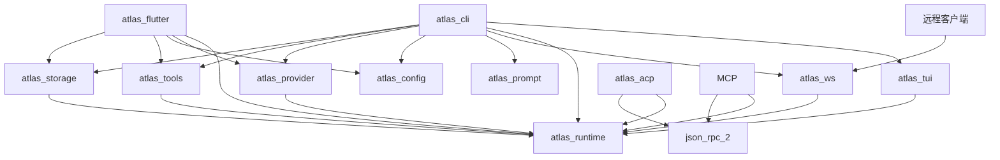

# 架构

[English](../architecture.md)

> **状态：** `atlas_runtime`、`atlas_storage`、`atlas_provider`
> 适配器、`atlas_config` 配置加载、内置 `atlas_tools`、`atlas_prompt`
> prompt 构建、`atlas_tui` Nocterm 聊天界面与 ACP 服务端适配器
> （`atlas_acp`，由 `atlas acp` 提供）均**Available**。`atlas_cli`
> `atlas_composition` 为 `atlas_cli` 与 `atlas_flutter` 提供共用的进程组装；
> MCP 适配器与 WebSocket transport 为 **Planned**。

## 系统形态

Atlas 使用唯一的 Dart runtime 实现，并通过本地应用组合根与可选远程
transport 提供能力。展示层或协议适配器不得维护第二套 Agent loop。

```mermaid
graph TD
    CLI[atlas_cli] --> TUI[atlas_tui]
    CLI --> RT[atlas_runtime]
    CLI --> WS[atlas_ws]
    CLI --> PROMPT[atlas_prompt]
    CLI --> CONFIG[atlas_config]
    CLI --> PROVIDER[atlas_provider]
    CLI --> TOOLS[atlas_tools]
    CLI --> STORAGE[atlas_storage]
    FL[atlas_flutter] --> RT
    FL --> PROVIDER
    FL --> CONFIG
    FL --> TOOLS
    FL --> STORAGE
    TUI --> RT
    REMOTE[远程客户端] --> WS
    WS --> RT
    ACP[atlas_acp] --> RT[atlas_runtime]
    MCP --> RT
    PROVIDER --> RT
    TOOLS --> RT
    STORAGE --> RT
    ACP --> JRPC[json_rpc_2]
    MCP --> JRPC
```

图中 `atlas_ws` 与 MCP 为 **Planned** 组件或连线，仅用于展示目标形态，当前
代码中尚未接线。

`atlas_composition` 从 `atlas_config`、provider、存储、工具与系统提示词构建器
组装一个 runtime；`atlas_cli` 与 `atlas_flutter` 的进程 bootstrap 共用这段
组装代码。运行 `atlas` 默认进入 Nocterm TUI；运行 `atlas acp` 时通过 NDJSON
stdio 将已组装的 runtime 暴露给 ACP 客户端（如 Zed 等编辑器）；规划中的
`atlas server` 子命令将通过 `atlas_ws` 把已组装的 runtime handler 暴露给远程
客户端。本地 Flutter 与 Nocterm 调用无需经过远程协议序列化。ACP 作为入口
适配到同一 runtime；MCP 主要用于把外部工具接入工具层。

## Package 职责

| Package | 职责 |
|---|---|
| `atlas_runtime` | Session/turn 领域模型、有序 timeline item、model/tool ports、唯一 Agent engine、取消、compact 与 skill |
| `atlas_storage` | Session、turn、有类型 timeline message 的 Drift 持久化；provider continuation 与 compact checkpoint 嵌入所属行，外加查询 |
| `atlas_provider` | OpenAI-compatible Chat Completions 和 Responses 以及 Anthropic Messages 适配器：认证、请求映射、SSE 解码、重试与响应转换 |
| `atlas_config` | YAML 配置文件 schema、加载与校验，并映射为 provider 配置对象 |
| `atlas_tools` | 返回结构化调用和结果的内置工具 |
| `atlas_prompt` | 系统提示词构建：操作模板、工具列表、`~/.atlas/AGENTS.md` 与工作目录 `AGENTS.md` 加载，以及平台/shell/日期上下文 |
| `atlas_ws` | 版本化 WebSocket wire contract、codec、client/server transport 与 runtime 转换 |
| `atlas_acp` | 把 ACP server 适配到共享 runtime |
| `atlas_mcp` | 优先实现 MCP client，server 按真实需求再增加 |
| `atlas_tui` | 基于注入的 runtime 接口的 Nocterm 聊天界面：消息记录、输入栏与 turn 状态 |
| `atlas_composition` | 共用的应用组装：构造 provider、工具、存储、提示词与唯一 runtime |
| `atlas_cli` | 默认 TUI 与其他 CLI 命令的组合根；委托 `atlas_composition` 构造 runtime |
| `atlas_flutter` | 桌面端与移动端应用外壳，已支持本地 runtime 组装；远程 WebSocket 仍规划中 |

## 依赖规则

- `atlas_runtime` 拥有领域模型与 ports，但不依赖 Flutter、存储、Provider、工具或 transport。
- 存储、Provider 与工具 package 依赖并实现 runtime ports；适配器不能拥有编排逻辑。
- Provider 特定请求字段只存在于 `atlas_provider`。
- `atlas_provider` 通过 `ModelRef` 选择已配置的 endpoint；公开配置使用程序化 API，不负责 CLI 或配置文件解析。
- OpenAI 与 Anthropic 共享 `HttpStreamClient`（重试、超时、取消）和 `decodeSse`（SSE 分帧）；`CompositeModelProvider` 按 provider 标识路由请求，使多个 provider 共享一个 runtime 实例。
- 流式失败会转换为一个 runtime 终态事件；只有首个流事件产生前才会重试，取消会桥接到 Dio 的 `CancelToken`。
- `atlas_ws` 可以依赖 runtime 类型，但必须维护显式的版本化 wire schema，不能直接序列化 runtime 对象。它接收注入的 request handler，且不负责组装 runtime 服务。
- 本地展示代码直接接收 runtime 接口；只有应用 bootstrap 可以创建 Provider、工具和存储适配器；两个应用根都使用 `atlas_composition`。
- `atlas_prompt` 只依赖 `atlas_runtime` 公开类型，组合根通过 `buildSystemPrompt` 使用它。
- `atlas_cli` 与 `atlas_flutter` 是独立的进程组合根，共享构造代码而不共享 runtime 实例。
- ACP 和 MCP 负责各自协议生命周期并直接使用 `json_rpc_2`；只有出现稳定重复代码后才提取共享 wrapper。

## Runtime 行为契约

当前 runtime 实现与后续适配器必须共同遵守以下产品级行为契约：

- 每个模型工具调用都按原顺序得到一个模型可见结果，失败也不例外。
- `AgentEvent` 按发生顺序发送，客户端不能在 turn 结束后重新分组输出。
- `Session` 包含有序的 `TimelineItem` 与持久化的 `Turn`。用户输入会和 running turn 原子写入，然后才发起第一个 Provider 请求。
- 每个 assistant message 可以携带 Provider 所有的 `ModelContinuation`；它内嵌在 assistant 行中持久化，并恢复到对应的 provider-neutral message。
- turn 启动前取消不产生 timeline item；用户输入已进入 runtime 后取消，需要保留中断边界。
- Skill 注入会保留历史中的原始用户文本；完整 skill 指令仅作为当前 turn 可见的模型上下文，不写入 transcript。
- Compact 保留持久 timeline，只替换 active context checkpoint（存储在 session 行）。runtime 原样保留最近若干完整 turn，把更早内容总结，并在 system prompt 中注入 `Context compacted. Kept {n} recent messages.` 与摘要。可选 compact 指令只影响摘要，不修改用户历史。

这些是产品行为约束，不表示需要兼容已删除 Go 实现的内部结构或数据库 schema。

## 本地安全边界

Atlas 工具使用本地 Atlas 进程的权限执行。产品不提供沙箱、权限提示或 approval gate；协议适配器不能宣称 runtime 实际不存在的安全边界。
