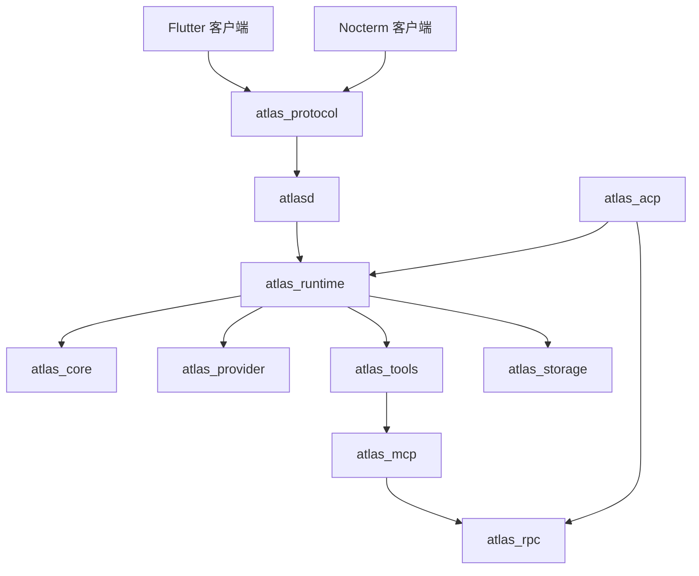

# 架构

[English](../architecture.md)

> **状态：** 规划中。当前只有 Flutter 应用外壳包含具体实现。

## 系统形态

Atlas 使用唯一的 Dart runtime，并通过多个协议与展示适配器提供能力。任何客户端或通道都不能维护第二套 Agent loop。

```mermaid
graph TD
    FL[Flutter 客户端] --> AP[atlas_protocol]
    TUI[Nocterm 客户端] --> AP
    AP --> D[atlasd]
    ACP[atlas_acp] --> RT[atlas_runtime]
    D --> RT
    RT --> CORE[atlas_core]
    RT --> PROVIDER[atlas_provider]
    RT --> TOOLS[atlas_tools]
    RT --> STORAGE[atlas_storage]
    TOOLS --> MCP[atlas_mcp]
    ACP --> RPC[atlas_rpc]
    MCP --> RPC
```

`atlasd` 是本地组合根，并提供版本化客户端协议。Flutter 与 Nocterm 都是该协议的客户端。ACP 作为入口适配到同一 runtime；MCP 主要用于把外部工具接入工具层。

## Package 职责

| Package | 职责 |
|---|---|
| `atlas_core` | 稳定领域模型、run 事件与 ports |
| `atlas_runtime` | 唯一 Agent engine、编排、取消、compact 与 skill |
| `atlas_storage` | SQLite 持久化与 schema migration |
| `atlas_provider` | Provider 认证与特定 wire format 转换 |
| `atlas_tools` | 返回结构化调用和结果的内置工具 |
| `atlas_rpc` | 通用 JSON-RPC transport 与请求生命周期 |
| `atlas_protocol` | Atlas 客户端与 `atlasd` 共享的版本化 DTO |
| `atlas_acp` | 把 ACP server 适配到共享 runtime |
| `atlas_mcp` | 优先实现 MCP client，server 按真实需求再增加 |
| `atlas_tui` | Nocterm 渲染与终端交互 |
| `atlasd` | 组合 runtime 并提供本地 WebSocket 服务 |
| `atlas_cli` | 命令行与终端应用入口 |
| `atlas_flutter` | 桌面端与移动端展示客户端 |

## 依赖规则

- `atlas_core` 不依赖 Flutter、存储、Provider、工具或 transport。
- Runtime effect 通过 core ports 进入；适配器不能拥有编排逻辑。
- Provider 特定请求字段只存在于 `atlas_provider`。
- 协议 DTO 不是持久化实体，也不暴露 Provider payload。
- Flutter 与 Nocterm 只依赖 `atlas_protocol`，不依赖 runtime 实现 package。
- ACP 和 MCP 负责各自协议生命周期；通用 JSON-RPC 行为放在 `atlas_rpc`。

## Runtime 行为契约

未来 runtime 必须保留以下产品级行为：

- 每个模型工具调用都按原顺序得到一个模型可见结果，失败也不例外。
- Run event 按发生顺序发送，客户端不能在 turn 结束后重新分组输出。
- Run 启动前取消不产生 timeline item；用户输入已进入 runtime 后取消，需要保留中断边界。
- 选择 skill 时，历史记录保留原始用户文本；完整 skill 指令是仅当前 turn 可见的模型上下文，不写入 transcript。
- Compact 保留持久 timeline，只替换 active context checkpoint；可选 compact 指令只影响摘要，不修改用户历史。

这些是产品行为约束，不表示需要兼容已删除 Go 实现的内部结构或数据库 schema。

## 本地安全边界

Atlas 工具使用本地 Atlas 进程的权限执行。产品不提供沙箱、权限提示或 approval gate；协议适配器不能宣称 runtime 实际不存在的安全边界。
