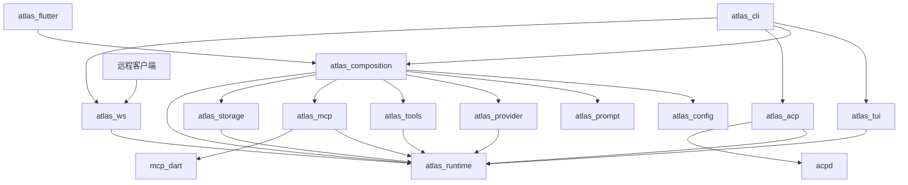

# 架构

[English](../architecture.md)

> **状态：** 本文描述的 package、客户端与 transport 均为 **Available**；尚未交付的边界标记为 **Planned**。

## 系统形态

Atlas 使用唯一的 Dart runtime，通过本地应用组合根与可选远程 transport 提供能力。展示层或协议适配器不得维护第二套 Agent loop。

```mermaid
graph TD
    CLI[atlas_cli] --> TUI[atlas_tui]
    CLI --> COMP[atlas_composition]
    CLI --> ACP[atlas_acp]
    CLI --> WS[atlas_ws]
    FL[atlas_flutter] --> COMP
    COMP --> CONFIG[atlas_config]
    COMP --> PROMPT[atlas_prompt]
    COMP --> PROVIDER[atlas_provider]
    COMP --> TOOLS[atlas_tools]
    COMP --> MCP[atlas_mcp]
    COMP --> STORAGE[atlas_storage]
    COMP --> RT[atlas_runtime]
    TUI --> RT
    ACP --> RT
    REMOTE[远程客户端] --> WS
    WS --> RT
    MCP --> RT
    PROVIDER --> RT
    TOOLS --> RT
    STORAGE --> RT
    ACP --> ACPD[acpd]
    MCP --> MCPSDK[mcp_dart]
```

`atlas_composition` 从 config、provider、存储、工具与系统提示词组装一个 runtime。`atlas_cli` 与 `atlas_flutter` 在各自的 bootstrap 中复用这段代码，但不共享 runtime 实例。

运行 `atlas` 进入 Nocterm TUI，它直接使用 runtime。`atlas acp` 通过 NDJSON stdio 将 runtime 提供给 ACP 客户端（如 Zed 等编辑器），`atlas server` 则通过 WebSocket 暴露同一套 ACP 接口：每个 text frame 承载一条 JSON-RPC 消息，由 bearer token 守卫。Flutter App 始终是 ACP 客户端，本地模式在进程内通过内存 transport 启动 `AcpServer`，远程模式通过 `acpd_io` 拉起第三方 agent。WebSocket 连接断开后，已开始的 turn 继续执行完毕，重连后通过 `session/load` 恢复。

`composeTools` 先连接配置的 MCP 服务器并固定工具目录，再把合并后的 registry 交给 `composeRuntime`。MCP 是客户端适配器，负责把外部工具接入工具层；ACP 会话级 MCP 配置仍为 Planned。

### CLI 关闭职责

每个 CLI 命令自行持有组装出的存储与 HTTP client。关闭时先停止接收新任务，调用 `AgentRuntime.shutdown()` 取消并等待活动 turn 与 compact，等待协议 handler，并在事件消费者继续消费、完成终态持久化之后关闭适配器资源。Nocterm bootstrap 与终端清理留在 `atlas_tui`，该 bootstrap 自然返回，不允许 Nocterm 直接终止进程。

## Package 职责

| Package | 职责 |
|---|---|
| `atlas_runtime` | Session/turn 领域模型、有序 timeline、model/tool ports、Agent engine、取消、compact 与 skill |
| `atlas_storage` | Session、turn 与有类型 timeline message 的 Drift 持久化，以及查询 |
| `atlas_provider` | OpenAI-compatible Chat Completions 和 Responses 以及 Anthropic Messages：认证、请求映射、SSE 解码、重试与响应转换 |
| `atlas_config` | Pi 风格的 `settings.json`、`models.json`、`mcp.json` 加载、校验与模型覆盖解析 |
| `atlas_tools` | 返回结构化调用与结果的内置工具 |
| `atlas_prompt` | 系统提示词构建，包括 `~/.atlas/AGENTS.md` 与工作目录指令文件 |
| `atlas_ws` | `/acp` 端点的版本化 WebSocket wire contract 与 transport |
| `atlas_acp` | 把 ACP 服务端适配到共享 runtime |
| `atlas_mcp` | 通过 `mcp_dart` 管理 MCP 客户端连接、发现、工具与结果映射、取消与清理 |
| `atlas_tui` | 基于注入 runtime 接口的 Nocterm 聊天界面 |
| `atlas_composition` | 共用组装：provider、工具、存储、提示词与唯一 runtime |
| `atlas_cli` | TUI 及其他 CLI 命令的组合根 |
| `atlas_flutter` | 桌面端与移动端 ACP 客户端；客户端本地偏好使用 `shared_preferences` |

## 依赖规则

- `atlas_runtime` 拥有领域模型与 ports，不依赖任何存储、Provider、工具、UI 或 transport 实现。
- 存储、Provider 与工具 package 实现 runtime ports；适配器不拥有编排逻辑。Provider 特定请求字段只存在于 `atlas_provider`。
- `atlas_provider` 通过 `ModelRef` 选择 endpoint。OpenAI 与 Anthropic 适配器共享 `HttpStreamClient` 与 `decodeSse`；`CompositeModelProvider` 按完整模型引用路由，使同一中转站的不同模型可以使用不同 API 和端点。流式失败表现为一个终态事件，只有首个流事件产生前才重试，取消桥接到 Dio 的 `CancelToken`。
- `atlas_ws` 拥有版本化 wire schema 与 transport 行为，不组装 runtime 服务。
- 只有应用 bootstrap 创建适配器；两个应用根都使用 `atlas_composition`，`atlas_prompt` 只依赖 `atlas_runtime` 公开类型。
- ACP 通过 `acpd` 负责协议生命周期；`atlas server` 为每个连接复用同一 `AcpServer`。MCP 在 `atlas_mcp` 内使用 `mcp_dart`，SDK 的 HTTP 依赖限于该适配器。

## 模型配置与认证

`atlas_config` 从设置、自定义模型和 MCP 文件解析不可变启动快照。`atlas_provider` 为受支持的内置 provider 提供随包分发或缓存的 models.dev 元数据，并负责请求时认证、自定义 headers 和兼容行为。`models` 新增或替换定义，`modelOverrides` 在目录加载后合并元数据。不支持的协议选项在加载时失败。Provider 键标识服务，包括任意中转站，没有独立的 connection 身份。

保存的 API key 位于 `auth.json`，更新通过串行队列、文件锁和原子替换完成。每次请求重新读取所选凭据并解析配置的环境变量或命令引用，列举模型不会执行凭据命令。目录刷新校验通过后才替换可重建缓存，损坏缓存回退到内置快照。配置和目录变化重启宿主后生效，保存的 key 变化在下一次请求生效。SQLite 继续保存会话记录，不成为第二份 provider 配置来源。

ACP 模型选项通过带版本的 `atlas.dev` 元数据传递上下文、输出上限、输入模态和推理选项。Atlas 客户端在会话更新后重建目录时保留这些字段，仍支持没有该扩展的第三方 ACP 选项。

## Flutter 客户端状态

Flutter 按功能组织产品代码：`settings`、`connections`、`workspace`、`files`、`terminal`。各功能拥有自己的 `presentation` Widget 与 Riverpod `application` controller，仅在需要插件、文件系统或存储适配器时增加 `data`；共享布局与窗口代码放在 `shared`。应用状态由 Riverpod `Notifier` 与 `AsyncNotifier` 持有，动画、焦点与菜单留在 Widget 中，功能的 presentation 代码不导入 bootstrap 或具体存储适配器。工作区 controller 把模型、模式与命令目录作为不可变 UI 状态暴露，输入组件无需查询 runtime；`shared/application` 中的工作目录 provider 由连接选择与工作区草稿共用。

macOS 上，App 在本地 bootstrap 前解析一次用户导出的登录 shell 环境，配置变量替换、shell 工具与 ACP 子进程都使用该快照；`Platform.environment` 不会被修改，shell 命令仍通过 `/bin/sh -c` 执行。解析有时间和大小上限，失败时完整保留继承的环境。

已保存的 ACP 与远程配置使用串行更新、写入成功后发布不可变快照的 repository。每个文件浏览器拥有自动释放的 controller，管理缓存、监听、预览与文件操作，文件系统访问封装在 `FileBrowserService` 之后。终端面板使用注入的会话接口，共享进程注册表在退出时终止仍在运行的 shell。

布局随可用宽度切换：宽度至少 960 逻辑像素时显示侧栏或分区导航栏（Android 与 iOS 同样适用），更窄时改用抽屉或横向分区选择器，移动端的触控区域保持更大。`go_router` 把 `/settings` 嵌套在 `/` 下，Android 与 iOS 注册 `atlas:///` 深链；HTTPS App Links 与 Universal Links 为 Planned。

## Runtime 行为契约

runtime 与所有适配器共同遵守以下产品级契约：

- 每个模型工具调用都按原顺序得到唯一模型可见结果（失败亦然）；`AgentEvent` 按发生顺序发送，客户端不得在 turn 结束后重新分组输出。
- 工具过程输出（`ToolOutputUpdated`）是可合并的临时替换事件，不进入持久 timeline 或模型上下文；每次调用仍恰好产生一个最终结果。
- 取消事件订阅会请求协作式取消，并等待配对的工具结果与 turn 终态持久化后再释放会话锁。
- `Session` 持有有序 `TimelineItem` 与持久化 `Turn`。用户输入与 running turn 原子写入后才发起首个 Provider 请求；每条 assistant message 可携带 Provider 所有的 `ModelContinuation`，内嵌在 assistant 行中持久化，并恢复到 provider-neutral message 上。
- turn 启动前取消不产生 timeline item；已从被中断模型流接收的文本以 aborted assistant message 持久化，并参与后续模型上下文。
- Skill 注入保留历史中的原始用户文本；完整 skill 指令是当前 turn 的模型上下文，不写入 transcript。
- 模型请求保持前缀稳定：system prompt 由冻结的 session context 重新拼装、运行上下文放在最后，timeline 投影只追加，skill 指令追加在投影历史之后。Anthropic 请求在最后一个工具、system prompt 与最后一条可缓存消息块上打 cache 断点，OpenAI Responses 与官方 OpenAI Chat Completions 请求把 session 标识作为 `prompt_cache_key` 发送，兼容中转站可启用 session affinity headers；`atlas cache` 从 session 数据库报告复用情况，不依据当前配置推断历史口径。
- Compact 保留持久 timeline，只替换 session 行上的 active context checkpoint。runtime 原样保留最近若干完整 turn，把更早内容总结为首条 `<context_summary>` user 消息，且不拆分 assistant/tool/result 组。可选 compact 指令只影响摘要；手动 compact 使用该 session 当前选中的模型，没有则回退到最后一个 turn 使用的模型。

这些契约描述预期行为，不表示需要兼容已删除的 Go 实现或其数据库 schema。

## 本地安全边界

Atlas 工具使用本地 Atlas 进程的权限运行，不提供沙箱、权限提示或 approval gate。协议适配器不得宣称 runtime 实际不存在的安全边界。
