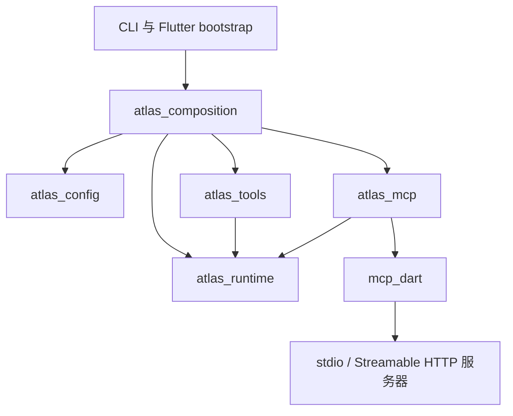

# MCP 客户端支持——开发计划

[English](../../plans/mcp-support.md)

> 状态：**Implemented（核心阶段 0–4）**。SDK：`mcp_dart` 2.4.2。
> stdio、Streamable HTTP 与静态请求头已实现。OAuth 与 ACP 会话级配置仍为后续
> 工作。当前使用约定见 [MCP 工具](../mcp.md)，下文保留开发计划及设计依据。
>
> 交付决定：禁用子进程/HTTP 自动重连，HTTP session 失效不得触发工具调用重放，
> 需要重启。Atlas 未对 SDK HTTP 缓冲设置字节限制，50 KiB 结果限额在解码后应用。
> ACP 通用工具标题已在实时事件和历史恢复中保留。评审后续项也已实现：限制目录
> 元数据体积，HTTP 超时改为放弃该连接而不是每次尝试泄漏一个请求，Flutter 退出
> 路径以有界等待释放活动 runtime。计划中的配置 DTO、异步资源组装、
> 两类传输、超时、取消、安全错误摘要、固定工具目录及文本/JSON 映射均已实现。

## 1. 目标与交付范围

让现有 Atlas agent 发现并调用已配置 MCP 服务器的工具。相同工具应能用于
CLI TUI、`atlas acp`、`atlas server` 和 Flutter 桌面本地模式。
移动端及远程客户端使用运行 Atlas 的电脑所持有的 MCP 连接。

核心交付分为两个里程碑：先完成本地 **stdio** 工具，再支持远程
**Streamable HTTP** 工具及静态请求头认证（包括 bearer token）。两个里程碑
完成后，才算完成本计划的首期范围。配置放在 `~/.atlas/config.yaml`，重启生效。

| 能力 | 交付安排 |
|---|---|
| 多服务器配置、工具发现与调用 | 核心范围 |
| stdio 子进程传输 | 第一里程碑 |
| Streamable HTTP，无认证或静态请求头认证 | 第二里程碑 |
| 文本与结构化 JSON 结果、错误、超时、取消 | 核心范围 |
| 复用工具事件、持久化、历史恢复和通用工具展示 | 核心范围 |
| OAuth 浏览器登录、token 存储与刷新 | 后续 |
| 动态工具目录刷新与连接管理 UI | 后续 |
| ACP 传入的会话级 `mcpServers` | 后续 |
| MCP resources、prompts、roots、sampling、elicitation、Tasks、Apps | 后续 |
| 将图片、音频工具结果传给模型 | 后续 |
| Atlas 自身作为 MCP 服务器；旧 HTTP+SSE 传输 | 不在核心范围 |

仅声明 Atlas 已实现的可选客户端能力。SDK 支持某项能力，不代表产品已支持。
不能通过已配置 token 访问的 OAuth 服务器，需要等待后续认证功能。

## 2. 当前代码与约束

| 现有位置 | 接入含义 |
|---|---|
| `packages/atlas_runtime/lib/src/ports/tool_registry.dart` | `Tool` 和 `ToolRegistry` 已能描述、执行外部工具。 |
| `packages/atlas_runtime/lib/src/domain/timeline.dart` | `ToolResult.content` 是文本，metadata 是 JSON；二进制及多模态结果需要明确转换策略。 |
| `packages/atlas_runtime/lib/src/agent/turn_executor.dart` | 每次模型请求读取工具描述，异常产生配对结果；接入必须保留这些保证。 |
| `packages/atlas_tools/lib/src/local_tool_registry.dart` | 单个不可变 registry 可以同时持有内置工具和 MCP 包装器；首期无需 composite registry。 |
| `packages/atlas_composition/lib/src/runtime_composer.dart` | 同步组装已支持注入 registry，系统提示词也使用它；创建 runtime 前完成工具发现。 |
| `apps/atlas_cli/lib/src/runtime_resources.dart` | 同步资源构造需要增加异步创建入口。 |
| `apps/atlas_flutter/lib/app/runtime_environment.dart` | bootstrap 已异步；关闭与启动失败清理也要持有并释放 MCP 资源。 |
| `packages/atlas_acp/lib/src/acp_server.dart` | 当前拒绝非空 `mcpServers`；全局配置支持不等于实现这个会话级协议约定。 |

`atlas_runtime` 保持协议无关，所有适配器复用唯一 agent loop。
保留 Atlas 的本地进程权限模型，不增加权限确认或沙箱。工作目录及未来的
MCP roots 表达上下文，不构成文件访问限制。

## 3. SDK 与包边界

采用 `mcp_dart`。本计划检查了已发布 **2.4.2** 的源码归档，其 Dart 约束为
`^3.4.0`，兼容 Atlas 的 `^3.13.0` 基线。相关公开 API 包括：

- `McpClient`、`McpClientOptions`、`McpProtocol.stable`：协议协商及旧初始化流程回退。
- `StdioClientTransport` / `StdioServerParameters`：子进程、环境变量、工作目录、消息限额及清理。
- `StreamableHttpClientTransport` / `StreamableHttpClientTransportOptions`：远程端点及通过 `requestInit` 传入静态请求头。
- `listTools`、`callTool`、`RequestOptions.signal`、`timeout`、`maxTotalTimeout`、`onprogress`：工具发现与执行。

用户已允许 MCP 依赖引入 `package:http`。直接使用 SDK 的 HTTP 实现，无需改造
为 Dio transport。模型 provider 与其他 Atlas HTTP 功能继续使用 Dio。
此例外写入 `AGENTS.md`，实现时同步写入 `atlas_mcp/README.md`。

开始实现时创建 `packages/atlas_mcp`，依赖 `atlas_runtime` 与 `mcp_dart`，
负责连接和协议映射，公开边界只暴露 Atlas 自有类型。为 SDK import 使用前缀，
避免 `Tool`、`ToolResult` 等同名类型混淆。

配置 DTO 属于 `atlas_config`，由 composition 映射成 `atlas_mcp` 连接选项；
两者无需相互依赖。`atlas_mcp` 不负责 YAML 加载、provider、storage、agent
编排或 UI。`atlas_tools` 继续负责内置工具及 registry。

在 `packages/atlas_mcp` 首次实际 import SDK 时执行 `dart pub add`，提交解析后的
workspace lockfile。其他直接依赖也只在实现需要 import 时添加，不为后续里程碑
预声明依赖。锁定并测试实际解析到的 SDK 版本，不根据 GitHub 未发布示例实现。

## 4. 拟议配置约定

以下为 schema 设计，当前尚不可用。增加可选 `mcp_servers` 列表，默认空列表，
保留配置文件中的顺序。

| 字段 | 含义与建议默认值 |
|---|---|
| `name` | 必填且唯一的服务器标识，格式为 `[A-Za-z0-9_-]+`。 |
| `transport` | 必填，区分 `stdio` 和 `streamable_http`。 |
| `enabled` | 布尔值，默认 `true`；禁用项不建立连接。 |
| `startup_timeout_seconds` | 正整数，默认 `15`；覆盖单个服务器连接及全部工具发现分页。 |
| `call_timeout_seconds` | 正整数，默认 `60`；每次工具调用的总截止时间。 |
| `command`、`args` | 仅 stdio；非空可执行命令及字符串参数列表，不做 shell 命令解析；`args` 默认空列表。 |
| `cwd` | 仅 stdio；可选绝对路径，展开开头的 `~/`；省略时使用捕获的 Atlas 进程启动目录。 |
| `env` | 仅 stdio；覆盖 bootstrap 环境快照的字符串映射，默认空。 |
| `url` | 仅 HTTP；HTTP(S) 绝对地址，不允许 userinfo 或 fragment；保留 query，但诊断中隐藏 query。 |
| `headers` | 仅 HTTP；字符串映射，默认空，可提供静态 bearer token。 |

使用现有 config loader 接收到的环境快照，展开 `env`、`headers` 值中的
`${VAR}`。缺失变量只报告字段路径和变量名，不打印值。禁用项仍检查结构，但
跳过凭据替换与 I/O，因此禁用某项集成时不必保留其凭据。拒绝与 transport 不符的
字段、错误类型、重复名称、非法请求头名或换行，以及对 SDK 自有协议请求头的覆盖。
时长解析不得超过 Dart `Duration` 可表示范围。

将合并后的环境显式传入 stdio，并设置 `includeParentEnvironment: false`；
bootstrap 快照本身已包含继承的环境。在 macOS Flutter 中保留解析出的登录 shell
`PATH`。不额外启动 shell，也不自动安装可执行程序。配置的 `cwd` 用于服务器进程，
切换 Atlas 会话目录不会改变该进程目录。远程客户端的凭据留在 Atlas 主机上；
远程 Flutter 客户端不会把本机 MCP 配置应用到另一个 agent。

stdio 里程碑期间，明确拒绝尚未实现的 `streamable_http`，在 HTTP 里程碑才启用
该分支。相关实现可用前，不把配置示例写入当前功能的配置指南。

## 5. 连接与组装生命周期

每个组装好的 runtime 对每个启用服务器持有一条连接。该 runtime 的所有会话共享
这些连接和不可变工具目录，不随最近发起调用的会话改变 roots 或服务器工作目录。

在 `atlas_composition` 增加异步 `composeTools`，返回持有 `ToolRegistry` 及幂等
`close()` 的工具资源对象。它创建内置工具、连接 MCP、包装发现的工具，最终生成
一个 `LocalToolRegistry`。内部复用已有内置工具创建逻辑；保留同步
`composeRuntime`，通过 `tools:` 传入准备好的 registry。应用仍决定何时启动与
关闭资源。

启动流程：

1. 解析配置并捕获环境、启动目录；`--help`、`--version` 和 `atlas cache` 不连接 MCP。
2. 按配置顺序连接启用项，获取全部工具分页。每个服务器只有一个总体启动截止时间，检测重复 cursor。
3. 校验工具目录后，再将完整 runtime 提供给消费者。
4. 任一启用项失败，报告服务器名和安全的失败分类，启动失败；关闭已打开的所有资源，包括失败中的连接。空 `mcp_servers` 保持原有本地启动行为。

版本协商交给 SDK，先显式使用 `McpProtocol.stable`，在阶段 0 验证旧协议回退。
Atlas 不自行实现 JSON-RPC。SDK 的传输恢复行为必须经过测试，结果不确定的普通
调用不得重放；恢复事件流与重新执行工具是两种行为。重新建立连接后，继续接收
调用前重新核对工具目录；首期若目录改变，要求重启 Atlas。不增加应用层重试循环。

关闭时停止接收新工作，取消并等待 runtime turns 结束，让 ACP/事件消费者完成
处理，再关闭 MCP 连接，最后关闭 provider HTTP 客户端和 storage。
等待 turn 结束期间，消费者继续接收事件。即使先前某项关闭失败，也执行其余清理，
用安全摘要报告未完成清理。启动超时必须关闭正在建立的 transport，包括截止时间
之后才出现的子进程；只对 `Future` 调用 timeout 不足以释放资源。

CLI TUI、ACP、server 命令均改为等待资源创建，并处理启动期间的退出信号。
Flutter 本地 bootstrap 在 ACP 连接失败后等待清理，释放适配器前明确关闭本地
runtime。普通远程 ACP/WebSocket 断线仍允许主机端已有 turn 完成。

## 6. 工具映射与模型可见行为

### 工具目录与命名

把服务器声明且本期支持的工具映射为 Atlas `Tool` 包装器，保留输入 JSON Schema
和说明，并保留原始服务器/工具身份用于诊断。拒绝格式无效的 schema，不静默展开
或削弱 schema。通过现有三种 provider 请求格式验证代表性 schema。

生成确定性的模型工具名，只含 ASCII 字母、数字、下划线和连字符，最长 64 字符。
使用可读的服务器/工具前缀，加上原始名称对的稳定摘要；不能使用 Dart `hashCode`。
编码后检测冲突，不允许覆盖。dispatch map 保留原始名称，调用 `tools/call` 时
使用原始名称。服务器内按原始工具名排序，保留配置的服务器顺序及现有内置工具
顺序，避免连接完成时机改变模型上下文。

首期在启动时固定目录，并限制目录元数据体积：description 截断到 2 KiB，单个
工具 schema 超过 64 KiB 及单服务器目录合计超过 1 MiB 会启动失败。目录变化通知只
产生有界的“需要重启”诊断，不在 turn 中途改变模型 schema。按协商结果处理旧通知或 SDK 的订阅机制。不自动把服务器返回的
instructions 加进系统提示词，也不声称支持必须使用可选 Tasks 执行的工具。

### 调用与结果

- 将参数原样转发到选定的服务器和工具。每次 Atlas 调用仍产生恰好一条最终结果，包括传输失败。
- 保留文本内容块顺序。有 `structuredContent` 时，将其序列化为模型可见文本中的 JSON，包括新协议允许的标量和数组；不能只放进模型看不到的 metadata。
- 内嵌文本资源和 resource-link URI 转成有界文本，不自动抓取链接。图片、音频、二进制资源用明确的省略标记替代。若成功响应只有不支持的二进制内容，返回解释限制的适配器错误；真正空的成功结果仍然有效。
- 保留 MCP `isError`。协议、认证、断连、超时和取消分别映射为安全且可区分的摘要。服务器返回的工具文本仍是工具输出，不用 SDK 原始异常或日志替代。
- 持久化及模型可见输出限为 **50 KiB UTF-8**，包含截断标记。metadata 同样有界，不能保留第二份无限制结果或 base64 数据。记录服务器/工具身份、截断及失败分类；只有在同一个结果总预算内才保留结构化 JSON。
- 若服务器提供进度，将其转为有界文本，使用已有临时 `ToolOutputSnapshot` 事件。不持久化进度，不注入模型上下文，忽略最终结果后的迟到进度。

首期保持模型和 timeline 中工具输出为文本，无需数据库迁移。后续多模态结果必须
同时扩展领域类型、storage、provider 投影和客户端展示。

### 取消与失败

将 `ToolContext.cancellation` 桥接到该请求的 SDK abort signal，处理进入时已取消
的情况，并在完成后清理桥接。即使持续收到进度，也执行工具调用总截止时间。
取消单个调用不得取消其他会话的请求。取消意味着 Atlas 结束等待，并在协议支持时
发出取消信号，不能保证远端副作用已被撤销。已交付的例外：Streamable HTTP 超时或
取消会将该连接标记为不可用（`connection_abandoned`）并在后台关闭，因为 SDK 2.4.2
无法中断在途请求，继续调用会不断泄漏新请求。stdio 连接保持可用。

如果服务器可能已经执行操作，但响应丢失，报告结果不确定。不仅凭
`readOnlyHint` 或 `idempotentHint` 重试。使用计数器工具验证 SDK 恢复不会重复执行。

捕获并有界消费 stdio stderr，不让任意子进程输出进入 ACP stdout 或破坏 TUI。
通过已有 logger 记录安全分类，不记录配置环境/请求头值、完整认证 URL、原始协议
消息或任意 SDK 异常字符串。保留 SDK stdio 消息限额；单独测量并记录 HTTP 缓冲
限制，不能将最终结果限额当作传输层内存限额。

## 7. 开发阶段与审阅单位

| 阶段 | 工作 | 完成条件 |
|---|---|---|
| 0——SDK 集成验证 | 用发布版 SDK 及受控 stdio、本地 HTTP 对端验证协议回退、请求头、分页、abort、启动清理、重连/重放和 HTTP 缓冲；将有价值的验证保留为集成 fixture。 | 确认所需公开 API，解决生命周期不确定性后再接生产入口。SDK 若违反约定，修复或明确缩小支持范围，不能默默带入实现。 |
| 1——配置与 stdio 适配器 | 创建 `atlas_mcp`、包 README、workspace 成员与实际依赖；加入 stdio 配置、连接管理、工具包装、结果转换及定向测试。 | 工具能经 registry 被发现、执行，覆盖成功、错误、超时和取消。 |
| 2——共享组装与入口 | 增加持有资源的异步工具组装；接入 CLI 所有 runtime 入口和 Flutter 本地 bootstrap，补全部分启动失败的清理。 | stdio 里程碑在 TUI、ACP、server、Flutter 可用，结果配对持久化，退出不遗留所属子进程。 |
| 3——Streamable HTTP | 启用 HTTP 配置、静态请求头及 SDK transport，测试 JSON/SSE 响应与协商的新旧协议路径。 | 本地测试端点可无认证或 bearer header 访问；401/403、断连和超时可见，不泄露 token、不重复调用。 |
| 4——跨客户端验证与文档 | 验证通用工具展示/历史恢复、并发、退出、provider schema 投影，更新现状文档及中文翻译。 | 核心验收矩阵通过，只公布已实现能力与实际限制。 |

阶段 0 为两类传输提供依据；阶段 3 在 stdio 里程碑完成后实施。每阶段形成可审阅
变更并配套定向测试。必要的新抽象是配置 DTO、连接资源所有者和工具包装器；不创建
通用 SDK 框架或 provider 专属的 MCP 执行路径。

预计改动位置：

- 新增 `packages/atlas_mcp`：公开连接选项/资源所有者，内部 stdio/HTTP 构造、工具包装、结果转换、集成 fixture。
- `atlas_config`：配置 DTO、解析器、字段校验测试。
- `atlas_composition`：异步工具组装及资源持有，更新包 README。
- `apps/atlas_cli`：resources、TUI/ACP/server 启动与生命周期测试。
- `apps/atlas_flutter/lib/app`：本地 bootstrap、关闭及 bootstrap 测试。
- 根 workspace manifest/lockfile；各能力可用时同步更新中英文架构、配置、工具及产品状态文档。

`atlas_runtime`、provider、storage 不应增加 MCP 专属生产逻辑；只有验证发现真实
问题时才修改通用客户端展示。更新 ACP 拒绝信息的解释，明确剩余限制是会话级配置，
同时保留对非空 `mcpServers` 的显式拒绝。

## 8. 验收与验证

| 边界 | 必须观察到的结果 |
|---|---|
| 配置 | 空配置/禁用项正常启动；错误 transport 字段、启用项缺凭据、名称重复、时长溢出均报告具体字段。 |
| 工具发现 | 多页、多服务器映射稳定；同名、长名、特殊字符工具不混淆；无效目录/重复 cursor 启动失败且释放资源。 |
| stdio | 环境快照与 `cwd` 到达子进程；stderr 不破坏 ACP；启动超时、早退、退出均完成结算并清理所属进程。 |
| HTTP | JSON/SSE、静态认证、401/403、session 丢失、恢复行为符合声明；诊断不包含 token。 |
| 调用 | 文本、纯结构化 JSON、混合内容、空结果、MCP 错误、大结果均产生约定结果。 |
| 取消 | stdio 卡住调用在截止时间内结束且连接仍可用；Streamable HTTP 卡住调用会结束、把该连接标记为不可用并给出重启提示，且不再向该连接发起请求。 |
| 重放安全 | 计数器变更后丢失响应，不会自动再次执行。 |
| Runtime | 内置工具与 MCP 工具保持模型顺序，每个调用恰有一条持久化结果，包括取消与失败。 |
| 展示 | TUI、Flutter 显示通用 MCP 调用、进度、最终错误；ACP `session/load` 恢复已完成结果。 |
| 范围 | ACP 传入 `mcpServers` 仍返回显式不支持错误；远程客户端仅使用主机配置工具。 |
| 生命周期 | 后一个服务器失败会关闭先前连接；Flutter ACP bootstrap 失败会关闭 MCP；进程退出等待 turns 完成后才关闭 storage。 |

先在相关 package 运行定向测试。实现交付前运行 `mise run ci`、
`mise run cli-build`，涉及 Flutter 平台接入时运行对应 `mise run app-build-*`。
确认 CLI 产物位于 `build/bundle/bin/atlas`，通过 Atlas 实际调用一个 stdio
子进程及一个本地 HTTP 服务器。fixture 应自包含，不要求生产凭据、付费模型 API
或测试时下载第三方服务器。再用独立实现的 MCP 服务器做人工冒烟测试，记录服务器
版本和 transport，补充 fixture 验证。

## 9. 后续工作与回滚

OAuth 需要明确登录入口、回调归属、token 存储、刷新、登出及 CLI/Flutter 行为，
围绕 SDK auth provider API 单独实施。普通启动流程不自动打开浏览器。

ACP 会话配置、会话 roots 和动态目录刷新需要按会话隔离的 registry，以及模型
请求和提示词共享的稳定工具快照。扩展现有全局 `ToolRegistry` 前，明确配置优先级、
生命周期、重连和会话恢复语义。不能仅删除 `_rejectMcpServers`，也不能让一个 ACP
连接直接修改进程全局 registry。

运行层面回滚可禁用相关 MCP 配置并重启 Atlas；代码回滚移除适配器接入及依赖。
已有文本工具历史仍可读取，无需数据库迁移。

## 10. 参考资料与证据范围

- [mcp_dart 2.4.2 发布版](https://pub.dev/packages/mcp_dart/versions/2.4.2)
- [发布版 API 文档](https://pub.dev/documentation/mcp_dart/2.4.2/)
- [包发布元数据](https://pub.dev/api/packages/mcp_dart)
- [SDK 仓库](https://github.com/leehack/mcp_dart)
- [Atlas 架构](../architecture.md)
- [Atlas 配置](../configuration.md)
- [Atlas 工具行为](../tools.md)

上述 SDK 能力检查基于发布归档源码，不只依据 README。实现验证使用独立 JSON-RPC fixture、真实 stdio 子进程和本地 HTTP，覆盖
2025-11-25/2026-07-28、JSON/SSE、静态/无认证、取消、结果限额及重放安全。
Runtime 测试验证有序持久化结果，Flutter 测试经 ACP 调用 HTTP 工具并恢复历史，
CLI 进程测试验证 stdio 归属和启动期间 SIGTERM 清理。编译后的 CLI 还通过独立
Python stdio 对端与本地模型端点完成工具调用、ACP 持久化恢复和 EOF 退出冒烟测试。
没有使用外部服务凭据。
SDK 自述的协议一致性测试不能替代这些 Atlas 集成测试。

交付检查通过：`mise run ci`、`mise run cli-build`、`mise run app-build-macos`、
`git diff --check`，并核对 CLI 与 macOS release 产物。分析器仍保留
`conversation_view_test.dart` 中一条原有 `unnecessary_import` info，平台相关
测试仍有跳过项。未执行其他平台 release 构建，也未使用第三方认证服务账号验证。
